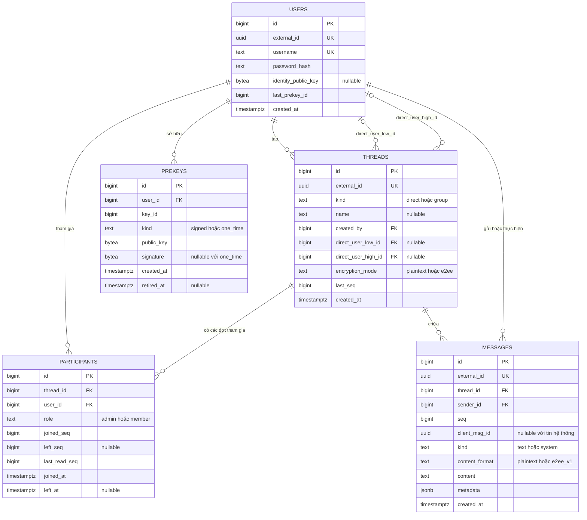

# ERD Mini-Hermes — 5 bảng

Bản nháp để review trước khi viết migration.

## Sơ đồ ERD

Mermaid đặt **kiểu dữ liệu trước tên cột** theo cú pháp của nó. Trong các bảng giải thích bên dưới, **tên cột đứng trước kiểu dữ liệu**. PK: khóa chính; FK: khóa ngoại; UK: duy nhất; nullable: được phép để trống.

## Giải thích 5 bảng

### `users` — Tài khoản

Lưu thông tin mỗi tài khoản một lần. Bài không làm nhiều thiết bị nên identity public key gắn với user; các prekey nhiều chiếc được tách sang bảng riêng.

| Tên cột | Kiểu dữ liệu | Giải thích |
|---|---|---|
| `id` (PK) | `BIGINT` | ID nội bộ của tài khoản, dùng để liên kết với các bảng khác. |
| `external_id` (UK) | `UUID` | ID công khai dùng qua API; không đưa ID số tự tăng ra ngoài. |
| `username` (UK) | `TEXT` | Tên đăng nhập; phải duy nhất sau khi chuẩn hóa. |
| `password_hash` | `TEXT` | Mật khẩu đã băm bằng bcrypt. Không lưu mật khẩu gốc và không trả trường này qua API. |
| `identity_public_key` (NULL) | `BYTEA` | Khóa định danh công khai phục vụ E2EE; chưa đăng ký E2EE thì để NULL. Khóa riêng chỉ ở client. |
| `last_prekey_id` | `BIGINT` | Key ID lớn nhất đã được chấp nhận, mặc định 0. Dùng với quy tắc upload để chặn cấp lại khóa cũ đã bị xóa. |
| `created_at` | `TIMESTAMPTZ` | Thời điểm tạo tài khoản. |

### `threads` — Cuộc trò chuyện

Tập hợp thành viên và lịch sử của một cuộc trò chuyện. Cặp ID nhỏ/lớn giúp database chặn hai thread 1-1 cho cùng một cặp người, dù ai tạo trước.

| Tên cột | Kiểu dữ liệu | Giải thích |
|---|---|---|
| `id` (PK) | `BIGINT` | ID nội bộ của cuộc trò chuyện. |
| `external_id` (UK) | `UUID` | ID cuộc trò chuyện dùng qua API. |
| `kind` | `TEXT` | Loại cuộc trò chuyện: direct (1-1) hoặc group (nhóm). |
| `name` (NULL) | `TEXT` | Tên nhóm, bắt buộc không rỗng với group. Thread direct để NULL. |
| `created_by` (FK) | `BIGINT` | Tham chiếu users.id: người tạo thread. Quyền hiện tại được xác định bằng participants.role. |
| `direct_user_low_id` (FK, NULL) | `BIGINT` | Tham chiếu users.id: ID nhỏ hơn trong cặp 1-1. Group để NULL. |
| `direct_user_high_id` (FK, NULL) | `BIGINT` | Tham chiếu users.id: ID lớn hơn trong cặp 1-1. Group để NULL. |
| `encryption_mode` | `TEXT` | plaintext hoặc e2ee. Trong phạm vi đề, group chỉ dùng plaintext. |
| `last_seq` | `BIGINT` | Thứ tự tin cuối đã lưu trong thread, mặc định 0. Việc tăng mốc và ghi tin phải nằm trong cùng transaction. |
| `created_at` | `TIMESTAMPTZ` | Thời điểm tạo cuộc trò chuyện. |

### `participants` — Thành viên và mốc đọc

Một user tham gia nhiều thread; mỗi người có quyền và mốc đọc riêng. Lưu từng đợt để không mất ranh giới quyền xem khi rời rồi được thêm lại nhóm.

| Tên cột | Kiểu dữ liệu | Giải thích |
|---|---|---|
| `id` (PK) | `BIGINT` | ID một đợt tham gia. Nếu rời rồi vào lại nhóm, tạo dòng mới để giữ lịch sử quyền truy cập. |
| `thread_id` (FK) | `BIGINT` | Tham chiếu threads.id: cuộc trò chuyện được tham gia. |
| `user_id` (FK) | `BIGINT` | Tham chiếu users.id: người tham gia. |
| `role` | `TEXT` | Vai trò admin hoặc member. Direct dùng member; người tạo nhóm ban đầu là admin. |
| `joined_seq` | `BIGINT` | Sequence đầu tiên được phép xem, tính cả mốc này. Direct bắt đầu ở 1; đây là ranh giới, không phải FK tới message. |
| `left_seq` (NULL) | `BIGINT` | Sequence cuối cùng được phép xem, tính cả mốc này. NULL nếu vẫn đang tham gia. |
| `last_read_seq` | `BIGINT` | Đã đọc đến đâu trong đợt tham gia này. Ban đầu bằng joined_seq - 1; cập nhật chỉ tiến lên. |
| `joined_at` | `TIMESTAMPTZ` | Thời điểm tham gia. |
| `left_at` (NULL) | `TIMESTAMPTZ` | Thời điểm rời hoặc bị xóa khỏi nhóm. Cùng NULL hoặc cùng có giá trị với left_seq. |

### `messages` — Tin nhắn

Tin người dùng và tin hệ thống dùng chung lịch sử, cùng thứ tự seq. Người nhận được xác định qua participants, nên không cần một receiver_id cố định.

| Tên cột | Kiểu dữ liệu | Giải thích |
|---|---|---|
| `id` (PK) | `BIGINT` | ID nội bộ của tin nhắn. |
| `external_id` (UK) | `UUID` | ID công khai của tin do server cấp; client có thể dùng để chống hiển thị lặp. |
| `thread_id` (FK) | `BIGINT` | Tham chiếu threads.id: cuộc trò chuyện chứa tin. |
| `sender_id` (FK) | `BIGINT` | Tham chiếu users.id: người gửi; với tin hệ thống là người thực hiện hành động. |
| `seq` | `BIGINT` | Thứ tự trong thread, bắt đầu từ 1; dùng sắp lịch sử, cursor và mốc đọc. |
| `client_msg_id` (NULL) | `UUID` | Client sinh cho mỗi lần chủ động gửi, giữ nguyên khi retry. Bắt buộc với tin text; NULL với tin system. |
| `kind` | `TEXT` | text: tin người dùng. system: thông báo do backend tạo, ví dụ thêm hoặc xóa thành viên. |
| `content_format` | `TEXT` | plaintext hoặc e2ee_v1. Phải phù hợp chế độ thread; tin system dùng plaintext. |
| `content` | `TEXT` | Văn bản hoặc ciphertext biểu diễn dưới dạng Base64. Với E2EE, không lưu bản rõ trong trường này. |
| `metadata` | `JSONB` | JSON object, mặc định {}. Chứa dữ liệu sự kiện hoặc header công khai như nonce, mã phiên, ID prekey; không chứa bí mật. |
| `created_at` | `TIMESTAMPTZ` | Thời điểm lưu tin, phục vụ hiển thị. Thứ tự trong thread được quyết định bởi seq. |

### `prekeys` — Khóa công khai đăng trước

Một user có nhiều khóa với vòng đời khác nhau. Client khác lấy public keys đã đăng trước để thiết lập phiên E2EE ngay cả khi người nhận offline.

| Tên cột | Kiểu dữ liệu | Giải thích |
|---|---|---|
| `id` (PK) | `BIGINT` | ID dòng dữ liệu do server cấp. |
| `user_id` (FK) | `BIGINT` | Tham chiếu users.id: chủ sở hữu khóa. |
| `key_id` | `BIGINT` | Mã khóa dương do client cấp; giúp client người nhận tìm đúng khóa riêng tương ứng. |
| `kind` | `TEXT` | signed: prekey có chữ ký. one_time: prekey chỉ được server cấp tối đa một lần. |
| `public_key` | `BYTEA` | Phần khóa công khai thực tế; không lưu khóa riêng. |
| `signature` (NULL) | `BYTEA` | Chữ ký của signed prekey, bắt buộc với kind=signed; one_time để NULL. |
| `created_at` | `TIMESTAMPTZ` | Thời điểm upload khóa. |
| `retired_at` (NULL) | `TIMESTAMPTZ` | Signed prekey đã nghỉ: không cấp cho bundle mới. NULL nếu chưa nghỉ; one_time luôn NULL và bị xóa khi cấp. |
