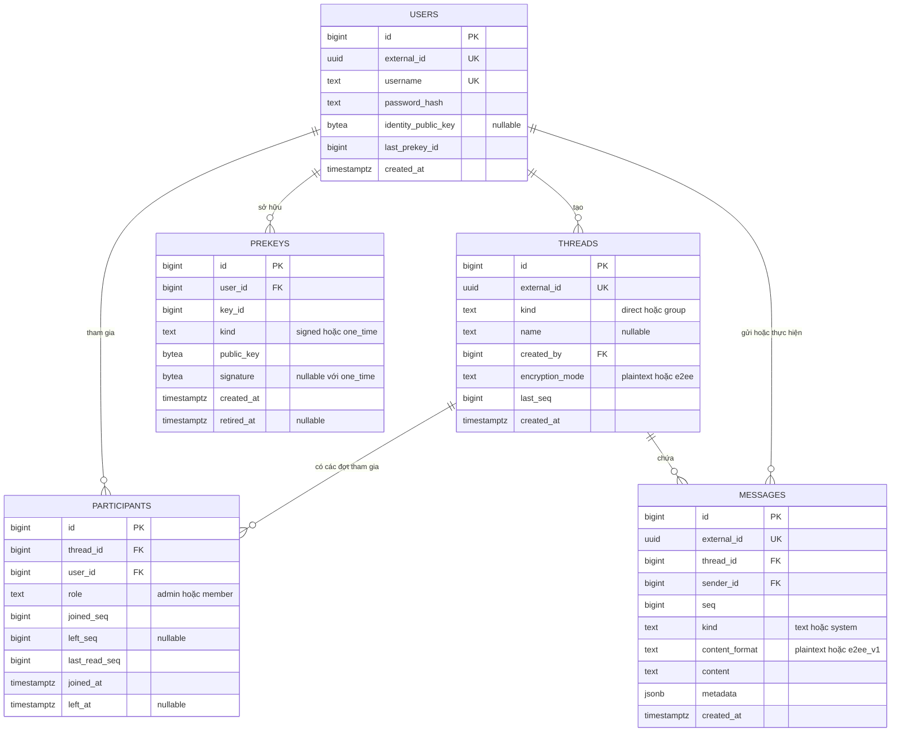

# ERD Mini-Hermes

Schema năm bảng sau migration `20260928090000_use_external_message_id.sql`. API dùng external UUID; `BIGINT` dùng nội bộ. PK: khóa chính; FK: khóa ngoại; UK: duy nhất.

```mermaid
erDiagram
    USERS ||--o{ THREADS : "tạo"
    USERS ||--o{ PARTICIPANTS : "tham gia"
    THREADS ||--o{ PARTICIPANTS : "có các đợt tham gia"
    THREADS ||--o{ MESSAGES : "chứa"
    USERS ||--o{ MESSAGES : "gửi hoặc thực hiện"
    USERS ||--o{ PREKEYS : "sở hữu"

    USERS {
        bigint id PK
        uuid external_id UK
        text username UK
        text password_hash
        bytea identity_public_key "nullable"
        bigint last_prekey_id
        timestamptz created_at
    }

    THREADS {
        bigint id PK
        uuid external_id UK
        text kind "direct hoặc group"
        text name "nullable"
        bigint created_by FK
        text encryption_mode "plaintext hoặc e2ee"
        bigint last_seq
        timestamptz created_at
    }

    PARTICIPANTS {
        bigint id PK
        bigint thread_id FK
        bigint user_id FK
        text role "admin hoặc member"
        bigint joined_seq
        bigint left_seq "nullable"
        bigint last_read_seq
        timestamptz joined_at
        timestamptz left_at "nullable"
    }

    MESSAGES {
        bigint id PK
        uuid external_id UK
        bigint thread_id FK
        bigint sender_id FK
        bigint seq
        text kind "text hoặc system"
        text content_format "plaintext hoặc e2ee_v1"
        text content
        jsonb metadata
        timestamptz created_at
    }

    PREKEYS {
        bigint id PK
        bigint user_id FK
        bigint key_id
        text kind "signed hoặc one_time"
        bytea public_key
        bytea signature "nullable với one_time"
        timestamptz created_at
        timestamptz retired_at "nullable"
    }
```

## Vai trò các bảng

| Bảng | Nội dung |
| --- | --- |
| `users` | Tài khoản, bcrypt password hash, IK public và watermark `last_prekey_id` |
| `threads` | Metadata, loại direct/group, mode mã hóa và `last_seq` |
| `participants` | Role, khoảng quyền xem `joined_seq..left_seq` và read marker của từng lần tham gia |
| `messages` | Tin text/system theo seq; E2EE lưu nguyên chuỗi JSON envelope trong `content` |
| `prekeys` | SPK/OPK công khai; private keys chỉ ở client |

## Ràng buộc chính

- `external_id` duy nhất; message còn có unique `(thread_id, seq)`. Client sinh message UUID cho retry; system message dùng UUID PostgreSQL.
- Participant có unique `(thread_id, user_id, joined_seq)` và tối đa một membership đang hoạt động cho mỗi cặp thread/user.
- Khoảng membership gồm cả mốc thêm/rời. Read marker bắt đầu ở `joined_seq - 1`, chỉ tăng và không vượt `threads.last_seq` qua API.
- Direct có tên NULL; group có tên không rỗng và chỉ dùng plaintext. Chống trùng cặp direct bằng khóa user trong repository, không có unique index cặp user trên `threads`.
- `metadata` mặc định `{}` trong các đường ghi hiện tại; header/nonce/ciphertext E2EE nằm trong `content`.
- Prekey có unique `(user_id, key_id)` với ID dương. SPK có chữ ký; OPK không có chữ ký/retired_at và bị xóa khi claim. IK/SPK bất biến; chưa dùng luân chuyển SPK.

Transaction và quyền truy cập: [luồng xử lý](request-flow.md). Envelope: [X3DH](e2ee-sequence.md).
