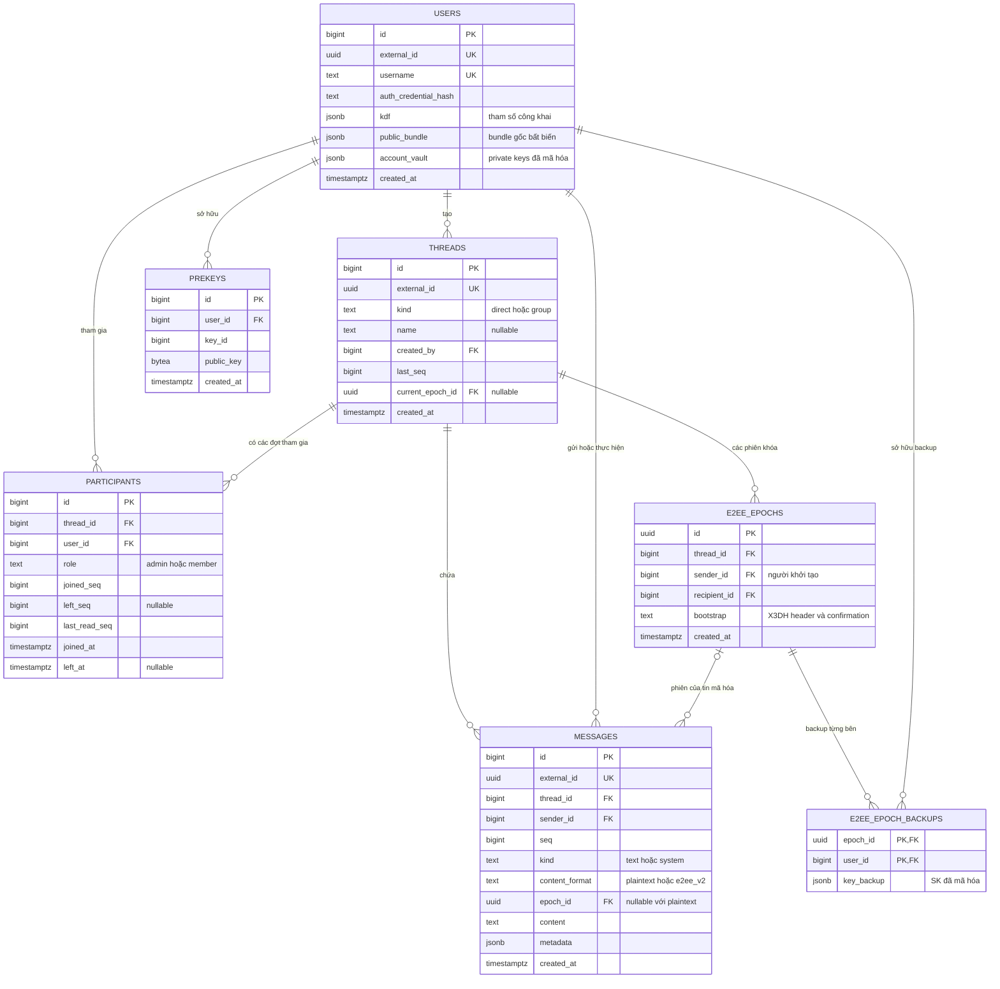

# ERD Mini-Hermes

Schema hiện tại có bảy bảng nghiệp vụ, sau migration `20261009100000`. Direct luôn dùng E2EE; group dùng plaintext, nên cách mã hóa được xác định từ `threads.kind`. API dùng external UUID; `BIGINT` dùng nội bộ. PK: khóa chính; FK: khóa ngoại; UK: duy nhất.

```mermaid
erDiagram
    USERS ||--o{ THREADS : "tạo"
    USERS ||--o{ PARTICIPANTS : "tham gia"
    THREADS ||--o{ PARTICIPANTS : "có các đợt tham gia"
    THREADS ||--o{ MESSAGES : "chứa"
    USERS ||--o{ MESSAGES : "gửi hoặc thực hiện"
    USERS ||--o{ PREKEYS : "sở hữu"
    THREADS ||--o{ E2EE_EPOCHS : "các phiên khóa"
    E2EE_EPOCHS o|--o{ MESSAGES : "phiên của tin mã hóa"
    E2EE_EPOCHS ||--o{ E2EE_EPOCH_BACKUPS : "backup từng bên"
    USERS ||--o{ E2EE_EPOCH_BACKUPS : "sở hữu backup"

    USERS {
        bigint id PK
        uuid external_id UK
        text username UK
        text auth_credential_hash
        jsonb kdf "tham số công khai"
        jsonb public_bundle "bundle gốc bất biến"
        jsonb account_vault "private keys đã mã hóa"
        timestamptz created_at
    }

    THREADS {
        bigint id PK
        uuid external_id UK
        text kind "direct hoặc group"
        text name "nullable"
        bigint created_by FK
        bigint last_seq
        uuid current_epoch_id FK "nullable"
        timestamptz created_at
    }

    PARTICIPANTS {
        bigint id PK
        bigint thread_id FK
        bigint user_id FK
        text role "admin hoặc member"
        bigint joined_seq
        bigint left_seq "nullable"
        bigint last_read_seq
        timestamptz joined_at
        timestamptz left_at "nullable"
    }

    MESSAGES {
        bigint id PK
        uuid external_id UK
        bigint thread_id FK
        bigint sender_id FK
        bigint seq
        text kind "text hoặc system"
        text content_format "plaintext hoặc e2ee_v2"
        uuid epoch_id FK "nullable với plaintext"
        text content
        jsonb metadata
        timestamptz created_at
    }

    PREKEYS {
        bigint id PK
        bigint user_id FK
        bigint key_id
        bytea public_key
        timestamptz created_at
    }

    E2EE_EPOCHS {
        uuid id PK
        bigint thread_id FK
        bigint sender_id FK "người khởi tạo"
        bigint recipient_id FK
        text bootstrap "X3DH header và confirmation"
        timestamptz created_at
    }

    E2EE_EPOCH_BACKUPS {
        uuid epoch_id PK,FK
        bigint user_id PK,FK
        jsonb key_backup "SK đã mã hóa"
    }
```

## Vai trò các bảng

| Bảng | Nội dung |
| --- | --- |
| `users` | Tài khoản, bcrypt credential dẫn xuất, KDF công khai, public bundle gốc và vault mã hóa |
| `threads` | Metadata, loại direct/group, `last_seq` và epoch hiện tại |
| `participants` | Role, khoảng quyền xem `joined_seq..left_seq` và read marker của từng lần tham gia |
| `messages` | Tin text/system theo seq; E2EE lưu JSON envelope trong `content` và tham chiếu epoch |
| `prekeys` | Hàng đợi public OPK còn khả dụng; claim xóa một dòng |
| `e2ee_epochs` | Bootstrap bất biến của mỗi phiên X3DH; sender/recipient là vai trò khởi tạo phiên |
| `e2ee_epoch_backups` | Backup SK mã hóa riêng của mỗi user trong epoch; PK ghép `(epoch_id, user_id)` |

## Ràng buộc chính

- `external_id` duy nhất; message còn có unique `(thread_id, seq)`. Client sinh message UUID cho retry; system message dùng UUID PostgreSQL.
- Participant có unique `(thread_id, user_id, joined_seq)` và tối đa một membership đang hoạt động cho mỗi cặp thread/user.
- Khoảng membership gồm cả mốc thêm/rời. Read marker bắt đầu ở `joined_seq - 1`, chỉ tăng và không vượt `threads.last_seq` qua API.
- Direct có tên NULL và chỉ dùng E2EE; group có tên không rỗng và chỉ dùng plaintext. Chống trùng cặp direct bằng khóa user trong repository, không có unique index cặp user trên `threads`. Repository kiểm tra `content_format` theo loại thread trước khi lưu tin mới.
- `metadata` mặc định `{}` trong các đường ghi hiện tại; envelope `epoch_id`/`recipient_id`/`nonce`/`ciphertext` nằm trong `content`. Bootstrap X3DH được lưu riêng trong `e2ee_epochs`.
- Prekey có unique `(user_id, key_id)` với ID dương và bị xóa khi claim. Public IK/SPK và chữ ký SPK nằm trong bundle gốc; private IK/SPK/20 OPK nằm trong account vault mã hóa. Bundle/vault không thay đổi khi public OPK bị tiêu thụ.
- Epoch có unique `(thread_id, id)`. FK ghép `(thread_id, epoch_id)` của message và `(id, current_epoch_id)` của thread bảo đảm không tham chiếu epoch thuộc thread khác.
- Message plaintext có `epoch_id=NULL`; `e2ee_v2` bắt buộc có epoch. Backend còn kiểm tra recipient là peer và hai bên đúng membership direct.
- Tạo epoch/current pointer/backup sender cùng transaction. Backup riêng được ghi một lần; giữ epoch cũ để giải mã lịch sử. Server lưu private keys và SK dưới dạng ciphertext, không nhận khóa dạng rõ.

Transaction và quyền truy cập: [luồng xử lý](request-flow.md). Envelope: [X3DH](e2ee-sequence.md).
