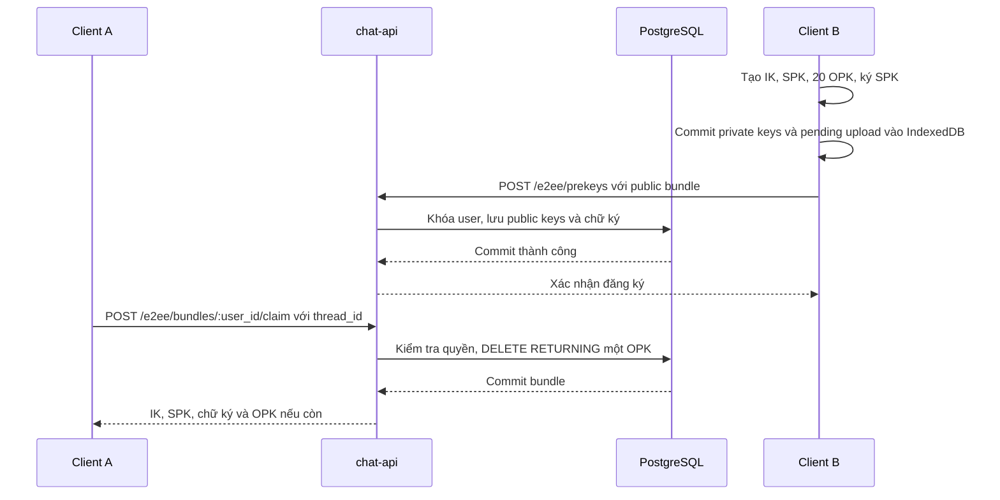
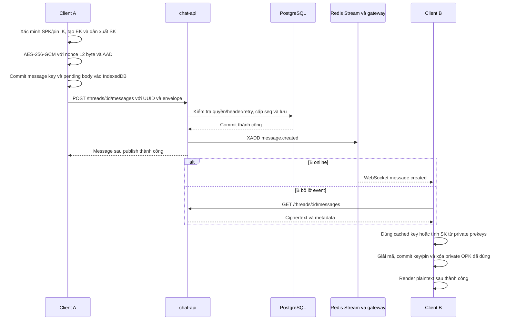

# Luồng X3DH cho direct E2EE

Go/WASM thực hiện X25519, HKDF-SHA-256 và AES-256-GCM. IK là khóa định danh; SPK là prekey có chữ ký; OPK được cấp một lần; EK là khóa tạm mới cho mỗi tin; SK là message key 32 byte.

## Đăng ký và claim bundle

Hai tài khoản đã đăng ký IK/SPK và có direct `encryption_mode=e2ee`. API xác thực bằng JWT; claim nhận body `thread_id` và kiểm tra cả hai participant đang hoạt động.

Claim chỉ trả sau commit. Hết OPK trả `one_time_prekey=null` và dùng 3DH; có OPK dùng 4DH. Private OPK giữ ở recipient tới khi giải mã thành công. IK/SPK bất biến; upload retry không khôi phục OPK đã cấp.

## Gửi và giải mã

## Quy tắc chính

- Request dùng `content_format=e2ee_v1`; `content` là chuỗi JSON gồm `version`, `recipient_id`, `sender_identity_key`, `ephemeral_key`, `signed_prekey_id`, `one_time_prekey_id`, `nonce`, `ciphertext`. Public keys, nonce và ciphertext dùng Base64.
- AAD ràng buộc hai IK, UUID thread/message/sender/recipient, EK và prekey IDs; không gồm seq/thời điểm. Kiểu payload: [types.go](../internal/e2ee/types.go); crypto: [crypto.go](../internal/e2ee/crypto.go).
- Mỗi tin mới, kể cả chiều trả lời, chạy lượt X3DH mới. Retry giữ nguyên UUID/body/key; publish lỗi sau commit trả `503`.
- Thiếu private OPK và cached key khi header có OPK ID phải báo lỗi, không chuyển sang 3DH. Giải mã/local commit lỗi không xóa OPK hoặc tăng read marker qua tin lỗi.
- IndexedDB giữ khóa/pending theo API URL/user UUID. Mỗi tài khoản dùng một profile cố định; Web Locks chọn một tab sở hữu E2EE. Server không nhận private key, SK hoặc plaintext E2EE.

Giới hạn bảo mật: [ADR 004](adr/004-e2ee-without-double-ratchet.md). Luồng đọc/realtime: [luồng xử lý](request-flow.md).
