# Sơ đồ các luồng Mini-Hermes

Theo code tại commit `25ed943`. `A`, `B`, `T`, `E`, `M` lần lượt là UUID user A, user B, thread, phiên khóa và tin nhắn. `...` trong ví dụ là dữ liệu được rút gọn.

- Direct: E2EE, một SK cố định cho mỗi thread; mỗi tin có khóa dẫn xuất riêng.
- Group: plaintext. Gửi tin bằng HTTP; nhận realtime bằng WebSocket.
- Các API nghiệp vụ dùng `Authorization: Bearer <JWT>`. Auth/register, auth/login, auth/params và health công khai.
- Link code dùng đường dẫn tương đối và `#L...`, mở được trên GitHub.

| Ký hiệu | Ý nghĩa trong các sơ đồ |
|---|---|
| IK / SPK / OPK | Cặp khóa định danh / prekey có chữ ký / prekey dùng một lần; mỗi cặp có public và private |
| EK | Cặp khóa tạm của người khởi tạo X3DH |
| SK / epoch | Khóa chung 32 byte / phiên khóa đã chọn cho thread |
| `vault_key` | Khóa dẫn xuất từ mật khẩu để mở account vault và dẫn xuất khóa backup |
| K_msg | Khóa riêng của từng tin, dẫn xuất từ SK + context |
| AAD | Metadata được xác thực cùng bản mã; sửa AAD thì AES-GCM không mở được |
| Nonce / ciphertext | Giá trị ngẫu nhiên cho lần mã hóa / kết quả mã hóa, gồm tag xác thực |
| Argon2id / HKDF | Dẫn xuất từ mật khẩu / dẫn xuất các khóa riêng từ khóa đầu vào |

## 1. Khởi động và các thành phần

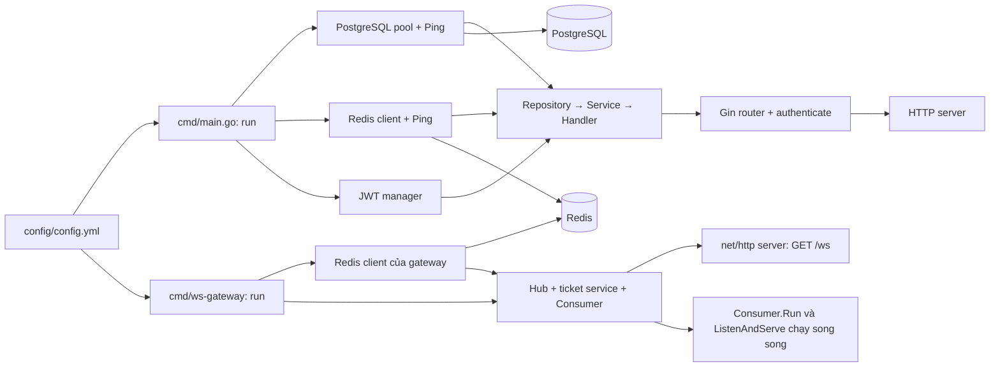

| Thành phần | Trách nhiệm |
|---|---|
| API / Gin | JWT, nghiệp vụ, lưu PostgreSQL, publish Redis |
| PostgreSQL | User, thread, membership/read marker, message, public prekeys, bản mã khóa |
| Redis | Vé WebSocket, membership cache, Stream sự kiện |
| Gateway / Hub | Giữ các connection theo user UUID; chuyển event tới mọi connection |
| Browser / Go-WASM | Dẫn xuất khóa, X3DH, AES-GCM, mở vault và giải mã tin |

Code: [API composition](../cmd/main.go#L37), [gateway composition và shutdown](../cmd/ws-gateway/main.go#L26), [router](../internal/route/router.go#L44).

### JWT cho request nghiệp vụ

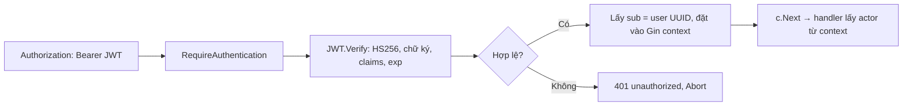

JWT được ký HS256; claims gồm `sub`, `iat`, `exp`. `SetTrustedProxies(nil)` giữ việc xác định IP theo kết nối trực tiếp. `/` và JS/CSS/WASM trả file trong `web/`; `/health` trả `{"status":"ok"}`.

Code: [middleware](../internal/middleware/auth.go#L16), [JWT Create](../internal/token/jwt.go#L51), [JWT Verify](../internal/token/jwt.go#L78), [static/health/routes](../internal/route/router.go#L61).

## 2. Đăng ký: khóa, dữ liệu mã hóa và dữ liệu gửi server

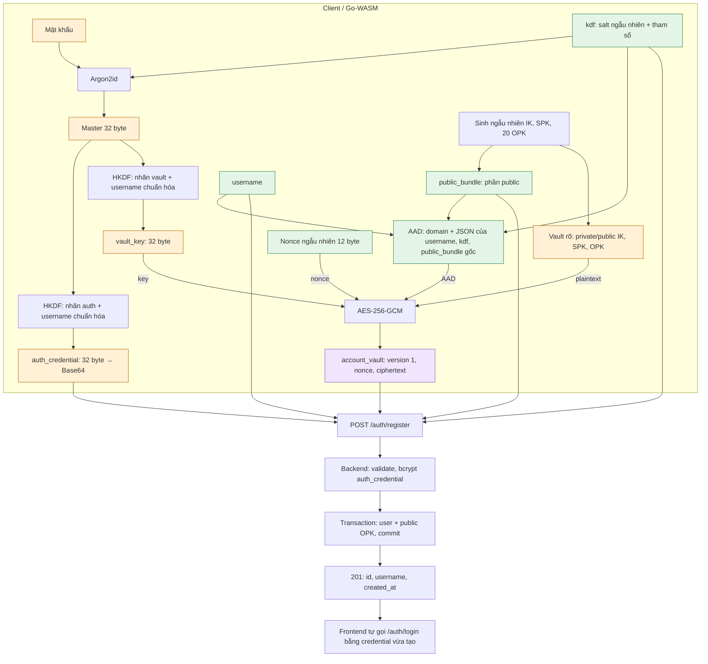

| Trường trong `POST /auth/register` | Nội dung |
|---|---|
| `username` | Trim + lowercase |
| `auth_credential` | Credential dẫn xuất; server bcrypt chuỗi Base64 |
| `kdf` | Profile công khai đã dùng để dẫn xuất khóa |
| `public_bundle` | IK public, SPK public/ID/chữ ký, 20 OPK public/ID |
| `account_vault` | Vault đã mã hóa; server không có `vault_key` |

```json
{
  "version": 1,
  "algorithm": "argon2id",
  "salt": "<Base64 của 16 byte ngẫu nhiên>",
  "memory_kib": 65536,
  "iterations": 3,
  "parallelism": 4
}
```

| Cấu trúc | Fields / trạng thái |
|---|---|
| `public_bundle` | `identity_public_key`; `signed_prekey:{key_id:1,public_key,signature}`; `one_time_prekeys:[{key_id,public_key}]`, ID 2–21 |
| Vault trước mã hóa | `version`, `identity:{private_key,public_key}`, `signed_prekey:{key_id,key_pair,signature}`, `one_time_prekeys:[{key_id,key_pair}]` |
| Record mã hóa | `{version:1, nonce:Base64, ciphertext:Base64}`; nonce 12 byte, ciphertext chứa GCM tag 16 byte |
| IK / SPK / OPK | Sinh một lần khi đăng ký; private OPK được giữ trong vault dù public OPK đã claim |

Code: [KDF/HKDF](../internal/e2ee/account.go#L21), [sinh khóa/vault](../internal/e2ee/account.go#L101), [AAD + mã hóa/mở vault](../internal/e2ee/account.go#L187), [AES record](../internal/e2ee/records.go#L38), [WASM](../cmd/e2ee-wasm/session_js.go#L67), [Register service](../internal/module/user/service/service.go#L49), [transaction đăng ký](../internal/module/user/repository/postgres.go#L26).

## 3. Đăng nhập, reload và khôi phục vault

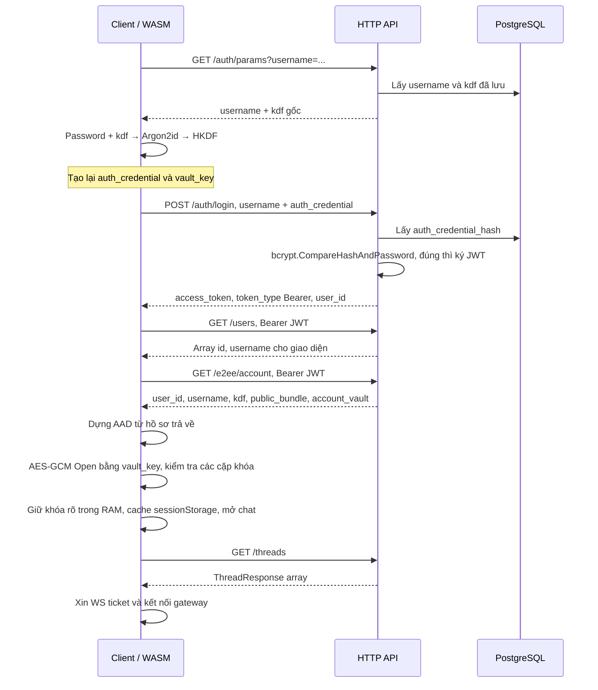

| API / trường hợp | Gửi | Nhận |
|---|---|---|
| `GET /auth/params` | Username, chưa cần JWT | `{username,kdf}` |
| `POST /auth/login` | `{username,auth_credential}` | `200 {access_token,token_type:"Bearer",user_id}`; sai credential: `401` |
| `GET /e2ee/account` | Bearer JWT | `{user_id,username,kdf,public_bundle,account_vault}` của chủ tài khoản |
| Reload cùng tab | JWT + `vault_key` từ sessionStorage | Gọi lại `/users` và `/e2ee/account`, mở vault; bỏ bước nhập mật khẩu/lấy auth params |
| Thiết bị/tab chưa có phiên | Username + đúng mật khẩu | Lấy cùng KDF → cùng vault key → mở lại đúng bộ khóa cũ |

`GET /users` phục vụ chọn peer/thành viên nhóm và username hiện tại. KDF/public bundle ngoài vault còn dùng để dựng AAD trước khi mở và đối chiếu khóa sau khi mở. Đăng nhập không sinh bộ IK/SPK/OPK mới.

Code: [Register/Login UI](../web/app.js#L1492), [restoreAuthenticatedSession](../web/app.js#L1455), [loadUsers](../web/app.js#L395), [Client.start / mở vault](../web/e2ee.js#L81), [Login service](../internal/module/user/service/service.go#L81), [auth DTO](../internal/module/user/dto/user.go).

## 4. Mở WebSocket và vòng đời gateway

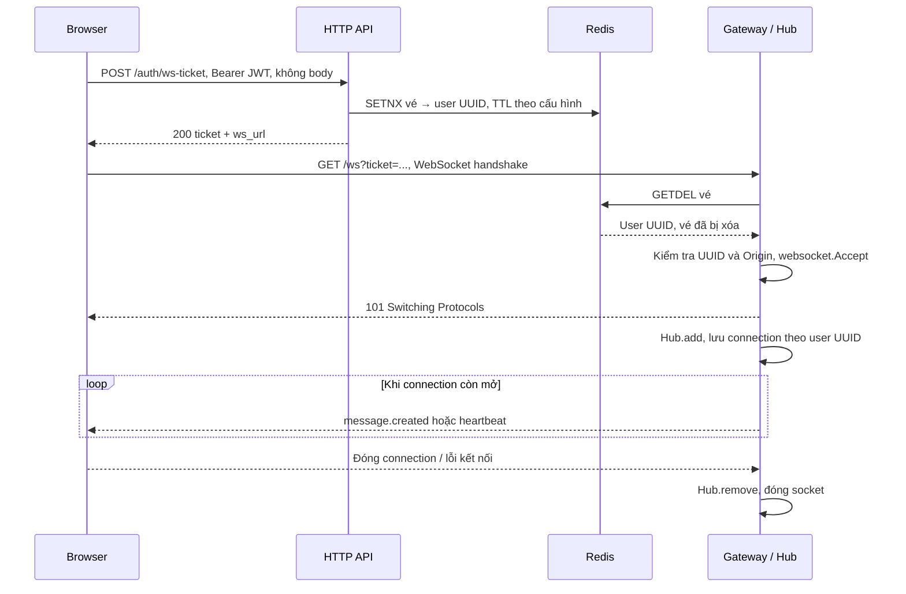

| Thành phần | Giá trị |
|---|---|
| Vé | 32 byte ngẫu nhiên, Base64 URL-safe; dùng một lần; Redis key `mini-hermes:ws-ticket:<ticket>` |
| Response xin vé | Chính xác `{ticket,ws_url}` |
| Hub | `clients[userUUID]` chứa nhiều connection, mỗi connection có hàng đợi gửi 64 frame |
| Writer | WebSocket text frame; timeout ghi 5 giây; heartbeat 5 giây; ping 30 giây |
| Lỗi/chậm | Đóng connection; client reconnect và bù lịch sử bằng REST |
| Dừng gateway | Dừng nhận connection, cancel consumer, đóng socket; hạn shutdown chung 5 giây |

Code: [client kết nối](../web/app.js#L922), [issue ticket](../internal/wsticket/handler.go#L28), [random ticket](../internal/wsticket/service.go#L30), [SETNX/GETDEL](../internal/wsticket/redis.go#L21), [gateway handler](../internal/gateway/handler.go#L31), [Hub/writer](../internal/gateway/hub.go#L59), [shutdown](../cmd/ws-gateway/main.go#L58).

## 5. Gửi tin chung: HTTP → PostgreSQL → Redis

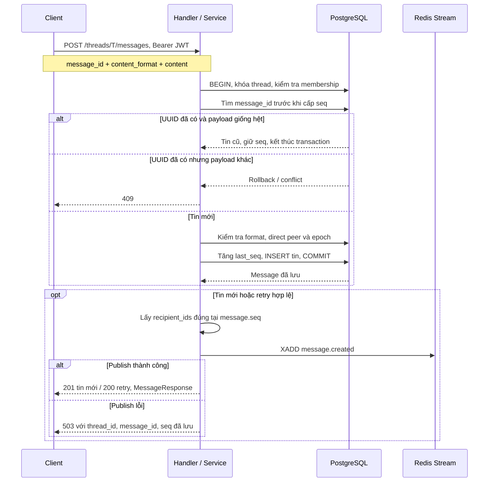

| Kênh / format | Gửi hoặc nhận |
|---|---|
| Tin nhóm | `{message_id:M, content_format:"plaintext", content:"Chào nhóm"}`; trim, 1–1000 ký tự Unicode |
| Tin direct | `{message_id:M, content_format:"e2ee_v2", content:STRING_JSON_ENVELOPE}` |
| HTTP `MessageResponse` | `{id,thread_id,sender_id,seq,kind,content_format,content,created_at}` |
| Redis Stream | `event:"message.created"`, `message_id`, `thread_id`, `thread_kind`, `sender_id`, `recipient_ids` (JSON string array), `seq` (string), `kind`, `content_format`, `content`, `created_at` |
| WebSocket frame | `{type:"message.created",message_id,thread_id,thread_kind,sender_id,recipient_id,seq,kind,content_format,content,created_at}`; `seq` là số |
| `503` sau commit | Tin vẫn trong PostgreSQL; retry giữ nguyên UUID và content; event có thể trùng |

Sender lấy từ JWT. `recipient_ids` gồm toàn bộ membership snapshot, kể cả sender. HTTP `id` và WS `message_id` là cùng UUID; HTTP/WS có thể đến xen nhau.

Code: [Send handler](../internal/module/message/handler/handler.go#L42), [Send service](../internal/module/message/service/service.go#L67), [transaction + retry](../internal/module/message/repository/postgres.go#L25), [message DTO](../internal/module/message/dto/message.go#L9), [PublishMessage](../internal/module/message/service/publish.go#L21), [XADD wire fields](../internal/module/message/publisher/redis.go#L26).

## 6. Consumer, fan-out và ACK

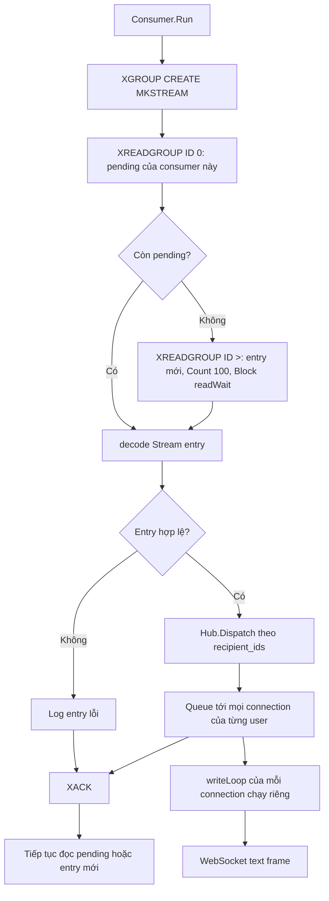

| Điều kiện | Kết quả |
|---|---|
| User có nhiều tab/thiết bị online | Mỗi connection nhận cùng event |
| User offline | Không có connection để queue; consumer vẫn ACK |
| Connection chậm, queue đầy | Đóng connection; client lấy bù REST |
| Decode lỗi | Log và ACK entry lỗi |
| Dispatch/ACK lỗi | Dừng lượt consume, phần chưa ACK còn pending |
| ACK thành công | Đã xử lý entry; không chứng minh giao tin hoặc người dùng đã đọc |

Hiện dùng một gateway instance, group `ws-gateway`, consumer `gateway-1`. ACK xảy ra sau dispatch/queue, không chờ writer thực sự giao frame.

Code: [consume pending/new](../internal/gateway/consumer.go#L47), [decode/dispatch/ACK](../internal/gateway/consumer.go#L95), [Hub.Dispatch](../internal/gateway/hub.go#L174), [writeLoop](../internal/gateway/hub.go#L122).

## 7. Chat nhóm: tạo, thêm/xóa thành viên, rời và chuyển admin

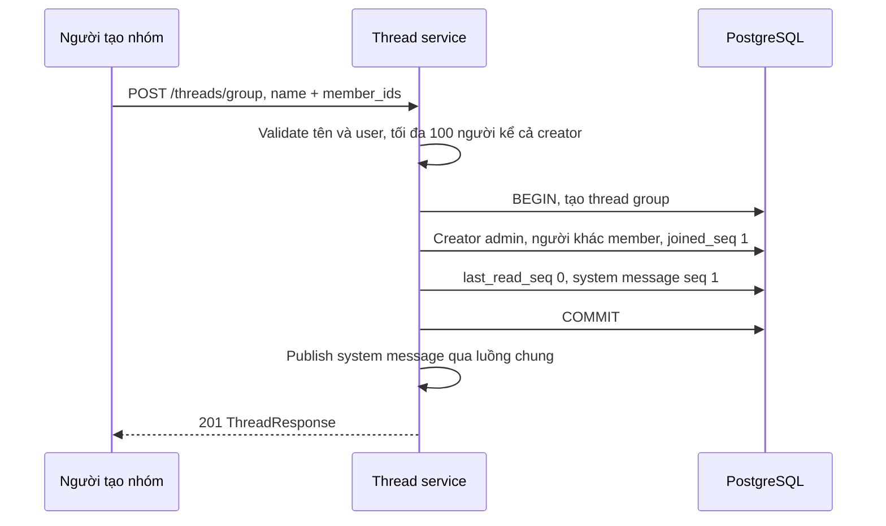

| API | Gửi | Quyền | Nhận |
|---|---|---|---|
| `POST /threads/group` | `{name,member_ids:[UUID,...]}` | User đăng nhập | `201 ThreadResponse` |
| `GET /threads/T/members` | T trên URL | Member active | Array `{id,username,role,joined_seq,last_read_seq}` |
| `POST /threads/T/members` | `{user_id:UUID}` | Admin | `200` system MessageResponse |
| `DELETE /threads/T/members/U` | T, U trên URL | Admin, không tự xóa mình | `200` system MessageResponse |
| `POST /threads/T/leave` | Không body | Member tự rời | `200` system MessageResponse |

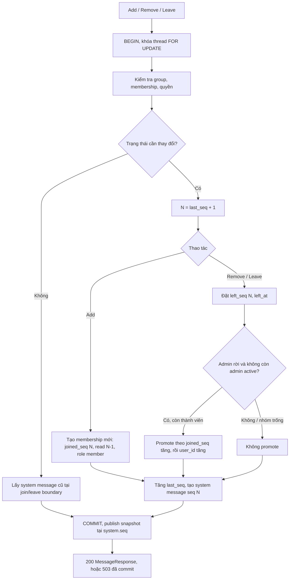

| Thay đổi | Membership / role | Người nhận system event tại N |
|---|---|---|
| Thêm B | `joined_seq=N`, `last_read_seq=N-1` | Có B |
| Xóa / B rời | `left_seq=N` | Vẫn có B; tin từ N+1 loại B |
| Admin cuối rời, còn C | C được promote; nối thông báo vào cùng system message | Snapshot tại N, gồm người vừa rời |
| Nhóm trống | Thread/lịch sử vẫn giữ, không promote | Snapshot của system message cuối |

`created_by` là metadata; quyền theo `role`. Nếu còn admin khác thì không chuyển quyền. Tạo nhóm không có idempotency key: nhận `503` phải đối chiếu `thread_id` trước khi tạo lại.

Code: [CreateGroup service](../internal/module/thread/service/groups.go#L12), [group transaction](../internal/module/thread/repository/groups.go#L14), [ChangeMember](../internal/module/thread/repository/groups.go#L45), [PromoteOldestGroupMember](../db/queries/groups.sql#L53), [member handlers](../internal/module/thread/handler/groups.go#L30).

## 8. Membership cache: version, snapshot và TTL

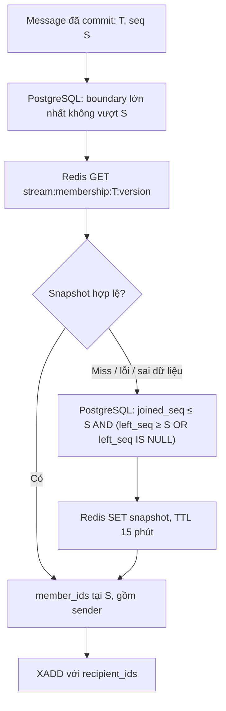

| Thuộc tính | Giá trị |
|---|---|
| Key | `<stream>:membership:<thread UUID>:<version>` |
| Value | `{thread_id,version,member_ids:[UUID,...]}` |
| Version | `MAX(boundary ≤ message.seq)`, boundary là `joined_seq` hoặc `left_seq+1` |
| TTL | 15 phút từ SET; GET hit không gia hạn |
| Lỗi đọc | Fallback PostgreSQL |
| Lỗi ghi | Tiếp tục publish |
| Quyền gửi/thay đổi nhóm | Kiểm tra trong transaction PostgreSQL, không lấy từ cache |

Ví dụ nhóm A–B tạo ở seq 1, thêm C ở seq 4, B rời ở seq 7:

| Message seq | Cache version | Snapshot |
|---|---|---|
| 1–3 | 1 | A, B |
| 4–7 | 4 | A, B, C; gồm system B rời tại 7 |
| Từ 8 | 8 | A, C |
| Retry tin seq 5 sau khi B rời | 4 | A, B, C |

Đổi membership tạo boundary mới; không cần xóa snapshot cũ. Một cache duy nhất vẫn hết hạn sau TTL; cache miss thì xây lại từ DB.

Code: [boundary/version SQL](../db/queries/messages.sql#L35), [snapshot SQL](../db/queries/messages.sql#L25), [messageRecipients](../internal/module/message/service/publish.go#L38), [Redis cache + TTL](../internal/module/thread/membership/redis.go#L14).

## 9. Danh sách chat, lịch sử, reconnect và dedup

| API | Gửi | Nhận / dùng để |
|---|---|---|
| `GET /users` | JWT | Array `{id,username}`: chọn người chat mới / thành viên nhóm |
| `GET /threads` | JWT | Array ThreadResponse: các thread đang tham gia |
| `GET /threads/T/messages` | `before_seq` tùy chọn, `limit` mặc định 30, tối đa 100 | `{messages:[MessageResponse,...],next_cursor}` |
| `before_seq=N` | N > 0 | Chỉ lấy `seq < N`, server trả `seq DESC` |
| `next_cursor` | Response | Seq cuối trang khi còn trang cũ hơn, hoặc `null` |

ThreadResponse gồm `id`, `kind`, `peer`, `name` nếu có, `role`, `member_count`, `last_seq`, `joined_seq`, `last_read_seq`, `peer_last_read_seq`, `unread_count`, `last_message`, `created_at`.

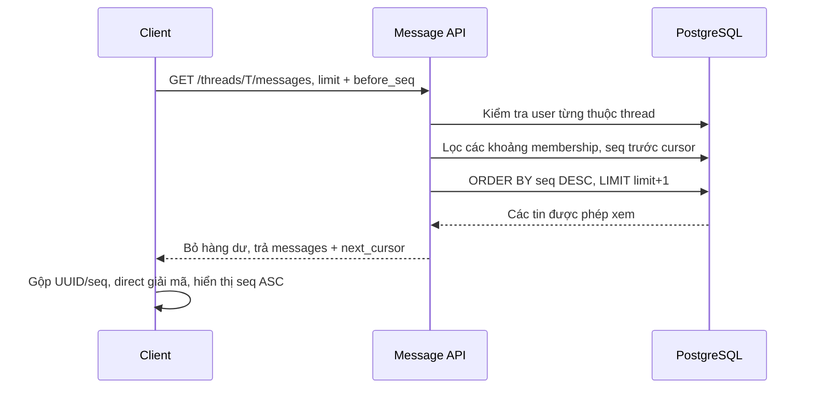

| Membership của B | Được xem | Không được xem |
|---|---|---|
| `[3..8]`, sau đó `[15..∞]` | Seq 3–8 và từ 15 | Seq 1–2 và 9–14 |
| Đã rời nhóm | Các khoảng tham gia cũ | Gửi tin / cập nhật read marker khi không active |

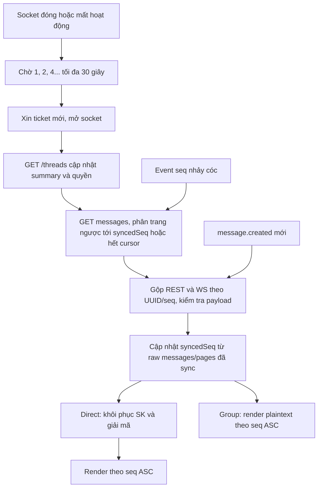

HTTP response, WS và lịch sử có thể chứa cùng một tin. Event không phải nguồn lịch sử duy nhất; client lấy bù từ PostgreSQL qua REST. Không có query `after_seq`.

Code: [ListThreads](../db/queries/threads.sql#L67), [thread DTO](../internal/module/thread/dto/thread.go#L50), [history SQL](../db/queries/messages.sql#L110), [List repository](../internal/module/message/repository/postgres.go#L167), [reconnect](../web/app.js#L882), [REST catch-up](../web/app.js#L746), [dedup/paging](../web/realtime-core.js#L3).

## 10. Đã đọc và số chưa đọc

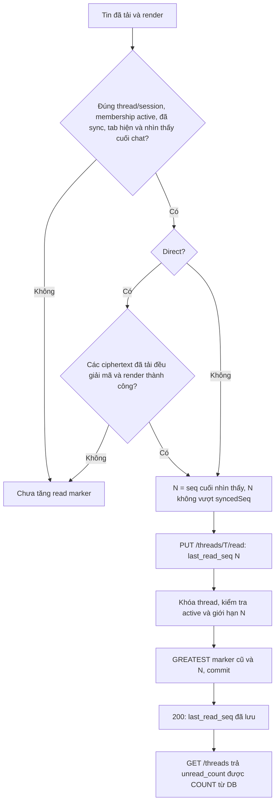

| Giá trị | Quy tắc |
|---|---|
| Gửi / nhận | `{last_read_seq:N}` / `{last_read_seq:giá trị đã lưu}` |
| Giới hạn backend | `joined_seq - 1 ≤ N ≤ threads.last_seq`; marker chỉ tăng |
| Unread hiện tại | COUNT các tin `seq ≥ joined_seq`, `seq > last_read_seq`, `sender_id ≠ user hiện tại` |
| Loại tin | Cả text và system; không đếm tin do chính user tạo |
| Lưu DB | Chỉ lưu read marker; không có counter unread lưu sẵn |
| Peer direct | `peer_last_read_seq` trong ThreadResponse |
| Realtime read | PUT/read không phát `message.created`; lấy summary để đối chiếu |

Code: [điều kiện frontend](../web/app.js#L1046), [flushReadMarker](../web/app.js#L1153), [MarkRead transaction](../internal/module/thread/repository/postgres.go#L138), [GREATEST SQL](../db/queries/threads.sql#L103), [unread COUNT](../db/queries/threads.sql#L31).

## 11. Chat 1-1: mở thread và tạo SK một lần

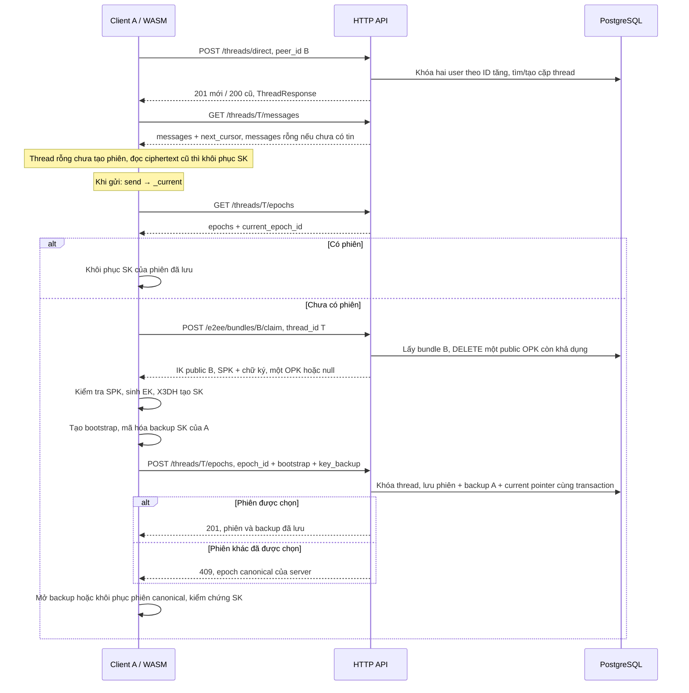

| API / dữ liệu | Fields |
|---|---|
| Tạo direct | Request `{peer_id:B}`; response ThreadResponse có `kind:"direct"`, peer B, 2 thành viên |
| GET epochs | `{epochs:[EpochResponse,...],current_epoch_id:UUID hoặc null}` |
| Claim response | `{user_id:B,identity_public_key,signed_prekey:{key_id,public_key,signature},one_time_prekey:{key_id,public_key} hoặc null}` |
| POST epochs | `{epoch_id:E,bootstrap:STRING_JSON_HEADER,key_backup:{version,nonce,ciphertext}}` |
| EpochResponse | `{epoch_id,thread_id,sender_id,recipient_id,bootstrap,key_backup}`; backup chỉ của người gọi |
| Retry đúng epoch UUID/payload | `200`, giữ phiên cũ |
| Đề xuất UUID phiên khác | `409 {error,epoch:phiên đã lưu}`; bỏ SK đề xuất thua |
| Hết public OPK | Dùng X3DH 3 DH; không refill; vault/private OPK gốc vẫn giữ |

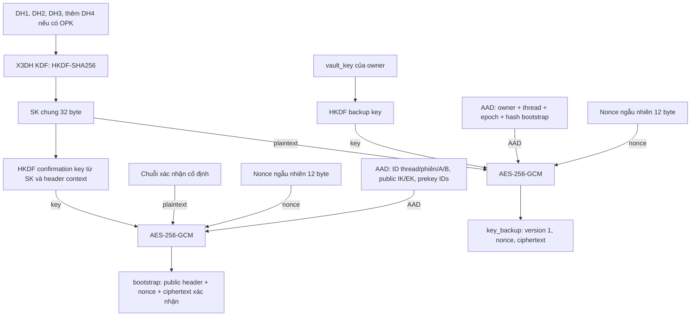

| DH | A khởi tạo | B khôi phục lần đầu |
|---|---|---|
| DH1 | `IK_A.private × SPK_B.public` | `SPK_B.private × IK_A.public` |
| DH2 | `EK_A.private × IK_B.public` | `IK_B.private × EK_A.public` |
| DH3 | `EK_A.private × SPK_B.public` | `SPK_B.private × EK_A.public` |
| DH4 nếu có OPK | `EK_A.private × OPK_B.public` | `OPK_B.private × EK_A.public` |

Bootstrap gồm `version:2`, `thread_id`, `epoch_id`, `sender_id`, `recipient_id`, `sender_identity_key`, `recipient_identity_key`, `ephemeral_key`, `signed_prekey_id`, `one_time_prekey_id`, `nonce`, `ciphertext`. `sender_id` trong bootstrap là người khởi tạo; EK riêng được xóa sau khởi tạo. Nhiều proposal có thể cạnh tranh nhưng chỉ một phiên được chấp nhận cho thread.

Code: [openDirect](../web/app.js#L1235), [chọn/khởi tạo phiên](../web/e2ee.js#L191), [CreateOrGetDirect transaction](../internal/module/thread/repository/postgres.go#L25), [claim](../internal/module/e2ee/repository/postgres.go#L40), [CreateEpoch transaction](../internal/module/e2ee/repository/postgres.go#L126), [X3DH A](../internal/e2ee/epoch.go#L121), [X3DH B](../internal/e2ee/epoch.go#L190), [owner backup](../internal/e2ee/epoch.go#L251), [epoch DTO](../internal/module/e2ee/dto/prekeys.go#L20).

## 12. Mỗi tin direct: dẫn xuất khóa và mã hóa

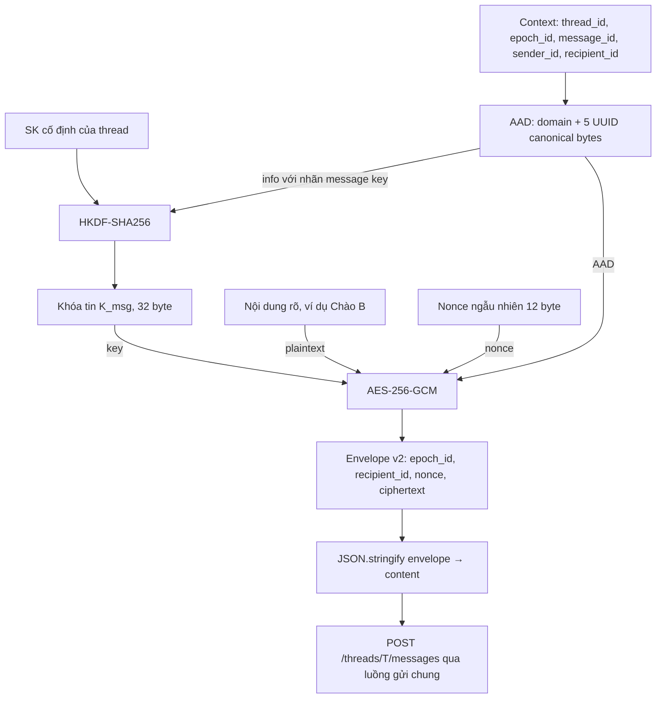

```json
{
  "message_id": "<UUID tin>",
  "content_format": "e2ee_v2",
  "content": "{\"version\":2,\"epoch_id\":\"<UUID phiên>\",\"recipient_id\":\"<UUID peer>\",\"nonce\":\"<Base64>\",\"ciphertext\":\"<Base64>\"}"
}
```

| Thành phần | Quy tắc |
|---|---|
| SK | Cùng cho A→B và B→A |
| Khóa tin | HKDF từ SK với context; UUID/chiều gửi khác tạo khóa khác |
| Context / AAD | Dùng cùng metadata cho HKDF và AES-GCM; client tự dựng, không gửi trường AAD riêng |
| Backend | Kiểm tra JWT sender, membership, recipient là peer, epoch thuộc thread; lưu bản mã và cấp seq |
| Nội dung HTTP/WS/lịch sử | Cùng envelope; server không có khóa rõ để đọc direct plaintext |
| Reply | Dùng lại SK, sinh UUID tin mới, đổi sender/recipient trong context |

Code: [send/outbox](../web/e2ee.js#L262), [context/AAD/HKDF](../internal/e2ee/messages.go#L9), [SealMessage](../internal/e2ee/messages.go#L85), [OpenMessage](../internal/e2ee/messages.go#L103), [validate peer/epoch](../internal/module/message/repository/postgres.go#L133).

## 13. Nhận tin, backup SK của B và nhiều thiết bị

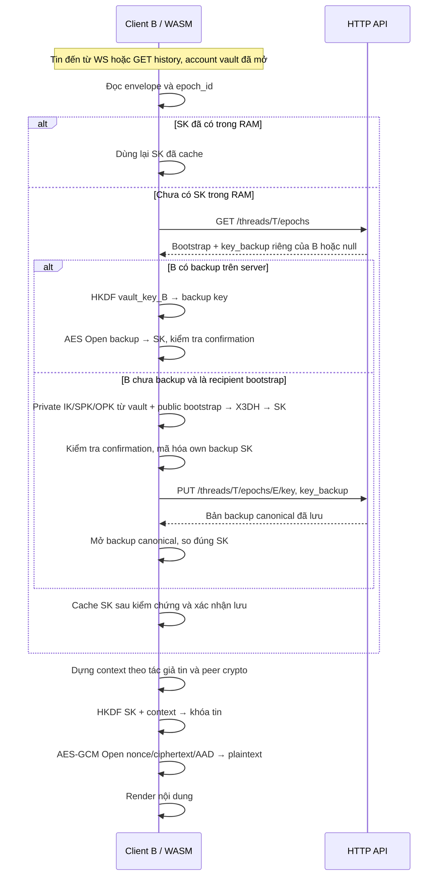

| Thời điểm / trường hợp | Backup và xử lý |
|---|---|
| A khởi tạo phiên | Lưu ngay backup A cùng phiên; backup B chưa có |
| B lần đầu xử lý tin, chưa backup | Tính cùng SK từ private prekeys + bootstrap; PUT backup B rồi chấp nhận SK |
| Máy/tab khác của B | Mở backup B đã lưu; không tính lại X3DH khi backup đã có |
| Máy khác của A | Mở backup A; máy mới không có EK riêng đã dùng lúc khởi tạo |
| Recipient offline, chưa từng mở phiên | Khôi phục private prekeys từ vault gốc, tính SK, tạo backup riêng |
| Hai thiết bị B cùng PUT backup | Server giữ bản đầu tiên, cả hai mở bản canonical và so SK |
| WS gửi bản sao cho thiết bị A | Outer `recipient_id=A` là delivery target; envelope recipient vẫn là B |

`sender_id` của message là tác giả tin hiện tại, khác vai trò initializer của bootstrap. HTTP `id` / WS `message_id` được dùng dựng context; không lấy outer WS recipient làm recipient crypto.

| Bản mã | Plaintext được bảo vệ | Khóa / AAD |
|---|---|---|
| `account_vault.ciphertext` | Bộ IK/SPK/OPK private/public | `vault_key`; username + KDF + public bundle gốc |
| `bootstrap.ciphertext` | Chuỗi xác nhận SK cố định | Khóa confirmation dẫn xuất từ SK; public header context |
| `key_backup.ciphertext` | SK 32 byte | Khóa backup dẫn xuất từ vault key owner; owner/thread/epoch/header hash |
| Envelope tin `.ciphertext` | Nội dung người dùng | Khóa tin từ SK; context 5 UUID |

Code: [restore/PUT ACK](../web/e2ee.js#L138), [receive](../web/e2ee.js#L295), [OpenEpochBackup](../internal/e2ee/epoch.go#L267), [backup transaction](../internal/module/e2ee/repository/postgres.go#L243), [backup không ghi đè](../db/queries/epochs.sql#L48).

## 14. Retry và nơi giữ dữ liệu

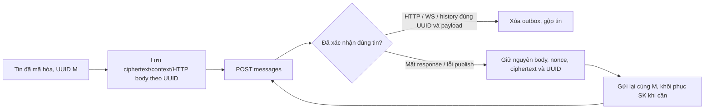

| Dữ liệu | Nơi giữ |
|---|---|
| JWT, username, user UUID, vault key | RAM + sessionStorage của phiên tab |
| Password / master | Client trong quá trình dẫn xuất; không gửi backend |
| Private IK/SPK/OPK và SK đã mở | Client RAM |
| Account vault + own SK backup | PostgreSQL, dạng mã hóa |
| Ciphertext pending | localStorage theo origin/user UUID/message UUID; fallback RAM |
| Lịch sử tin | PostgreSQL; nhóm plaintext, direct ciphertext |

Retry không tạo UUID/nonce/bản mã mới. Không Double Ratchet, đổi phiên thủ công, đổi mật khẩu hoặc OPK refill. Khôi phục lịch sử cần đúng mật khẩu và dữ liệu vault/backup/phiên còn trên server.

Code: [retry](../web/e2ee.js#L285), [outbox](../web/e2ee-state.js#L5), [cacheSession](../web/app.js#L1447), [API retry UUID](../internal/module/message/repository/postgres.go#L25).
