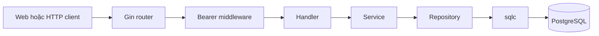

# Luồng request Mini-Hermes

## Ranh giới các tầng

- DTO chỉ định nghĩa JSON HTTP; không chứa `password_hash` hoặc ID `BIGINT` nội bộ.
- Handler bind request, lấy external user ID đã xác thực từ Gin context và ánh xạ lỗi HTTP.
- Service chuẩn hóa username, kiểm tra input, băm/so mật khẩu và tra actor nội bộ; không phụ thuộc Gin.
- Repository dùng sqlc/PostgreSQL, kiểm tra participant và giữ transaction.
- JWT manager trong `internal/token` ký/xác minh token, không phụ thuộc Gin.
- Bearer middleware chỉ xác minh token và đặt external user ID từ `sub` vào context; không truy vấn database.



## Auth

`POST /auth/register` dùng chung `NormalizeUsername`, kiểm tra password, băm bcrypt rồi ghi `password_hash`. Response không chứa mật khẩu hoặc hash.

`POST /auth/login` chuẩn hóa username, lấy credentials và so bcrypt. Sai username và sai password trả cùng `invalid username or password`. JWT HS256 chứa external UUID trong `sub`, cùng `iat` và `exp`; secret/TTL đến từ config runtime.

Một PostgreSQL user repository phục vụ cả đăng ký/đăng nhập, lookup user và danh sách user. Không còn constructor truyền cùng repository hai lần và không còn luồng tạo user thiếu password.

## Tạo hoặc mở direct thread

`POST /threads/direct` nhận `peer_id`; actor đến từ JWT.

1. Service tra actor và peer sang ID `BIGINT`, đồng thời chặn chat với chính mình.
2. Repository sắp cặp ID thành low/high và bắt đầu transaction.
3. Partial unique index trên cặp direct user bảo đảm chỉ một thread khi hai phía tạo đồng thời.
4. Request tạo mới ghi thread và hai participant trong cùng transaction. Request gặp conflict đọc lại thread vừa có.

## Gửi tin

`POST /threads/:id/messages` nhận `client_msg_id` và `content`, không nhận sender.

Trong một transaction, repository khóa thread đồng thời với việc xác nhận actor là participant đang hoạt động. Nó trả lại message cũ nếu cùng client ID đã tồn tại; nếu chưa, tăng `last_seq` rồi ghi message với sequence đó trước khi commit. Vì vậy hai người gửi đồng thời vẫn nhận sequence khác nhau và retry không tạo bản sao.

Thread tồn tại nhưng actor không phải participant trả `403`; thread không tồn tại trả `404`.

## Đọc lịch sử

`GET /threads/:id/messages` tra actor từ JWT và chỉ query khi actor là participant đang hoạt động. Response là mảng message theo `seq ASC`, phù hợp trực tiếp với web demo:

```json
[
  {
    "id": "message-uuid",
    "thread_id": "thread-uuid",
    "sender_id": "user-uuid",
    "seq": 1,
    "client_msg_id": "client-uuid",
    "kind": "text",
    "content_format": "plaintext",
    "content": "Xin chào",
    "created_at": "2026-09-25T00:00:00Z"
  }
]
```

Lượt này cố ý chưa có cursor, limit, read marker hoặc unread count.

## Web demo

Router phục vụ `web/index.html`, `web/app.js` và `web/style.css`. Giao diện:

1. Đăng ký rồi đăng nhập.
2. Lưu JWT vào `sessionStorage` của tab và lấy user hiện tại từ claim `sub`.
3. Gọi `GET /users` bằng Bearer token và chỉ hiển thị các tài khoản khác.
4. Khi chọn peer, gọi `POST /threads/direct`, sau đó tải lịch sử.
5. Gửi tin với `client_msg_id` do browser sinh và polling lịch sử mỗi 1,5 giây.
6. Khi API trả `401`, xóa session local và đưa người dùng về màn hình đăng nhập.

Không còn route `/messages` sender/receiver hoặc `POST /users`; client không có đường API để tự khai danh tính người gửi.
