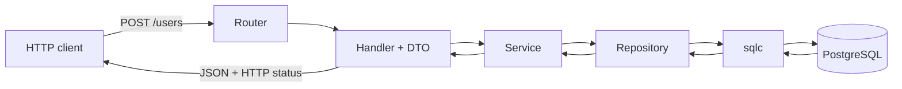

# Luồng request tạo người dùng

Ghi chú này mô tả ngắn luồng `POST /users` để đọc hiểu code và tự trình bày lại với mentor.

## Chiều request đi vào

1. **Router** (bộ định tuyến) trong `internal/route/router.go` ghép `POST /users` với hàm `Handler.Create`.
2. **Handler** (lớp xử lý HTTP) dùng Gin đọc JSON vào `dto.CreateUserRequest`. JSON sai định dạng được trả ngay với HTTP `400`. Nếu đọc được, handler chuyển `username` và `context` sang service; handler không làm nghiệp vụ hoặc truy cập database.
3. **Service** (lớp nghiệp vụ) chuẩn hóa username bằng cách bỏ khoảng trắng ở hai đầu với `TrimSpace`, rồi chuyển sang chữ thường. Sau đó service kiểm tra độ dài từ 1 đến 50 điểm mã Unicode và từ chối ký tự NUL. Dữ liệu không hợp lệ trả `model.ErrInvalidUsername` mà không gọi repository.
4. **Repository** (lớp truy cập dữ liệu) gọi phương thức do sqlc sinh từ query `CreateUser`. Repository cũng chuyển lỗi unique constraint của PostgreSQL thành `model.ErrUsernameTaken`, để các lớp phía trên không cần biết chi tiết pgx/PostgreSQL.
5. **sqlc** là công cụ sinh Go code có kiểu dữ liệu rõ ràng từ SQL. Câu `INSERT` chỉ truyền `username`; PostgreSQL tự sinh `id` số tăng, `external_id` dạng UUID và `created_at`.

## Chiều kết quả đi ra

PostgreSQL trả bản ghi mới qua sqlc cho repository. Repository chuyển `sqlc.User` thành `model.User`; bước này đổi UUID và thời gian từ kiểu của pgx sang kiểu model. Service trả kết quả cho handler. Cuối cùng, `dto.ToUserResponse` tạo JSON response và cố ý dùng `external_id` làm trường `id`; cột số tự tăng nội bộ không được đưa ra API. Khi thành công, client nhận HTTP `201 Created`.

## Ánh xạ lỗi sang HTTP

| Trường hợp | Lỗi model | HTTP |
| --- | --- | --- |
| JSON, username hoặc ID không hợp lệ | `ErrInvalidUsername` / `ErrInvalidUserID` | `400 Bad Request` |
| Username đã tồn tại | `ErrUsernameTaken` | `409 Conflict` |
| Không tìm thấy user theo `external_id` | `ErrUserNotFound` | `404 Not Found` |
| Lỗi ngoài dự kiến, ví dụ mất kết nối database | lỗi khác | `500 Internal Server Error` |

Handler chỉ trả thông báo chung cho lỗi `500` và ghi lỗi thật vào log, tránh làm lộ chi tiết nội bộ cho client.
