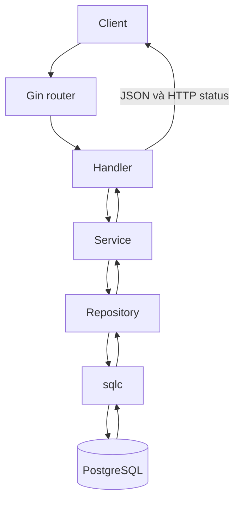

# Luồng request trong Chat API

## Vai trò các tầng

* **DTO**: định nghĩa JSON đầu vào và đầu ra.
* **Handler**: đọc HTTP request, gọi service và trả response.
* **Service**: chuẩn hóa dữ liệu và xử lý nghiệp vụ.
* **Repository**: gọi sqlc và chuyển dữ liệu thành domain model.
* **sqlc**: sinh Go code từ các câu SQL.
* **PostgreSQL**: lưu user và message.

## Luồng chung



Request đi theo chiều:

```text
Client → Gin → handler → service → repository → sqlc → PostgreSQL
```

Kết quả được trả ngược lại:

```text
PostgreSQL → sqlc → repository → service → handler → client
```

## `POST /users`

1. Gin chuyển request đến `user.Handler.Create`.
2. Handler đọc `username` từ JSON bằng DTO.
3. Service bỏ khoảng trắng, chuyển username thành chữ thường và kiểm tra dữ liệu.
4. Repository gọi `CreateUser` do sqlc sinh.
5. PostgreSQL tạo user và trả bản ghi về.
6. Handler chuyển `model.User` thành JSON và trả `201 Created`.

## `POST /messages`

1. Handler đọc `sender_id`, `receiver_id` và `content` từ JSON.
2. Message service kiểm tra hai user phải khác nhau và nội dung phải hợp lệ.
3. Message service gọi user service để tìm sender và receiver theo UUID.
4. User repository dùng sqlc lấy ID `bigint` nội bộ của hai user.
5. Message repository gọi `CreateMessage` để lưu tin nhắn.
6. Kết quả đi ngược qua sqlc → repository → service → handler.
7. Handler chuyển `model.Message` thành JSON và trả `201 Created`.

Message service dùng user service thay vì gọi thẳng user repository để giữ phụ thuộc đúng tầng và dùng lại logic tìm user.

## `GET /messages`

Ví dụ:

```text
GET /messages?user_id=<UUID>&peer_id=<UUID>
```

Handler lấy hai UUID từ query string. Service tìm hai user rồi gọi repository bằng ID nội bộ. sqlc lấy tối đa 100 tin nhắn gần nhất giữa hai người và trả theo thứ tự cũ đến mới. Handler trả danh sách JSON với HTTP `200 OK`.

## Quy ước ID

* ID `bigint` chỉ dùng nội bộ trong PostgreSQL.
* `external_id` dạng UUID được dùng trong API.
* Các trường `id`, `sender_id`, `receiver_id`, `user_id` và `peer_id` mà client sử dụng đều là UUID.

Hiện tại ứng dụng chưa có đăng nhập, thread hoặc WebSocket. Giao diện chọn user thủ công và lấy tin nhắn mới bằng polling mỗi giây.
