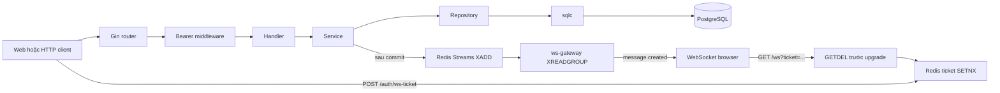

# Luồng request Mini-Hermes

## Ranh giới các tầng

- DTO chỉ định nghĩa JSON HTTP; không chứa `password_hash` hoặc ID `BIGINT` nội bộ.
- Handler bind request, lấy external user ID đã xác thực từ Gin context và ánh xạ lỗi HTTP.
- Service chuẩn hóa username, kiểm tra input, băm/so mật khẩu và tra actor nội bộ; không phụ thuộc Gin.
- Repository dùng sqlc/PostgreSQL, kiểm tra participant và giữ transaction.
- Message service gọi publisher Redis Streams sau khi repository đã commit; publisher không nằm trong transaction PostgreSQL.
- JWT manager trong `internal/token` ký/xác minh token, không phụ thuộc Gin.
- Bearer middleware chỉ xác minh token và đặt external user ID từ `sub` vào context; không truy vấn database.
- Vé WebSocket đi qua handler → service → Redis repository: API dùng `SETNX` với TTL; gateway dùng `GETDEL` nguyên tử trước khi upgrade.


```mermaid
flowchart LR
    C[Web hoặc HTTP client] --> R[Gin router]
    R --> M[Bearer middleware]
    M --> H[Handler]
    H --> S[Service]
    S --> P[Repository]
    P --> Q[sqlc]
    Q --> DB[(PostgreSQL)]
    S -->|sau commit| X[Redis Streams XADD]
    X --> G[ws-gateway XREADGROUP]
    G -->|message.created| W[WebSocket browser]
    C -->|POST /auth/ws-ticket| T[Redis ticket SETNX]
    W -->|GET /ws?ticket=...| U[GETDEL trước upgrade]
    U --> T
```

## Auth

`POST /auth/register` dùng chung `NormalizeUsername`, kiểm tra password, băm bcrypt rồi ghi `password_hash`. Response không chứa mật khẩu hoặc hash.

`POST /auth/login` chuẩn hóa username, lấy credentials và so bcrypt. Sai username và sai password trả cùng `invalid username or password`. JWT HS256 chứa external UUID trong `sub`, cùng `iat` và `exp`; secret/TTL đến từ config runtime.

Một PostgreSQL user repository phục vụ cả đăng ký/đăng nhập, lookup user và danh sách user. Không còn constructor truyền cùng repository hai lần và không còn luồng tạo user thiếu password.

## Tạo hoặc mở direct thread

`POST /threads/direct` nhận `peer_id`; actor đến từ JWT.

1. Service tra actor và peer sang ID `BIGINT`, đồng thời chặn chat với chính mình.
2. Repository sắp cặp ID thành low/high, bắt đầu transaction và khóa hai dòng `users` theo đúng thứ tự tăng dần. PostgreSQL row lock dùng chung giữa mọi connection/process/instance; thứ tự toàn cục này tránh deadlock khi các cặp giao nhau.
3. Sau khi có đủ hai khóa, repository tìm direct thread có đúng hai active participant là cặp đó, bất kể ai gửi request trước.
4. Nếu chưa có, repository ghi thread và hai participant trong cùng transaction. Request đồng thời đợi khóa rồi đọc lại thread vừa commit.

Không còn cột cặp user hay unique index tương ứng trên `threads`. Vì vậy cơ chế chống trùng phụ thuộc mọi đường ghi direct thread đều dùng transaction/khóa trên; thao tác SQL trực tiếp hoặc implementation khác bỏ qua khóa có thể tạo trùng.

## Gửi tin

`POST /threads/:id/messages` nhận `message_id` và `content`, không nhận sender. `message_id` là UUID client đã chọn cho `messages.external_id`; response vẫn trả external ID trong `id`.

Trong một transaction, repository khóa thread đồng thời với việc xác nhận actor là participant đang hoạt động. Sau đó nó tra `external_id` toàn cục:

1. UUID đã thuộc đúng sender, thread, kind/format và nội dung: trả message cũ, không tăng `last_seq`.
2. UUID đã gắn với bất kỳ dữ liệu nào khác: trả `409 Conflict` chung, không trả message cũ nên không lộ nội dung/người gửi/thread của người khác.
3. UUID chưa có: tăng `last_seq`, ghi message với sequence đó và commit.

Unique constraint trên `messages.external_id` xử lý cả race giữa các thread/instance. Nếu insert thua race, toàn transaction (kể cả tăng sequence) rollback và API trả conflict. Hai request retry giống hệt trong cùng thread được serialize bởi khóa thread nên chỉ có một row.

Sau khi repository trả thành công, service phát một entry `event=message.created` bằng `XADD`. Entry dùng external UUID `message_id`, `thread_id`, `sender_id`, `recipient_id` cùng `seq`, `kind`, `content_format`, `content`, `created_at`. `recipient_id` được repository lấy từ active participant còn lại trong PostgreSQL, không đến từ client.

Publisher chạy với timeout cấu hình. Lỗi transaction/quyền/UUID conflict xảy ra trước publisher nên không có event. Nếu PostgreSQL đã commit nhưng XADD lỗi, API trả `503` để client retry đúng UUID và payload. Retry không tạo message hay tăng `seq`, nhưng vẫn XADD lại. Do timeout có thể xảy ra sau khi Redis đã nhận lệnh, stream có thể chứa entry trùng; gateway chuyển tiếp từng entry và client khử trùng theo `message_id`. Luồng này không phải exactly-once và không thể bảo đảm realtime nếu client không retry.

Thread tồn tại nhưng actor không phải participant trả `403`; thread không tồn tại trả `404`.

## Đọc lịch sử

`GET /threads/:id/messages` tra actor từ JWT và chỉ query khi actor là participant đang hoạt động. `limit` mặc định 30, nằm trong `1..100`; `before_seq` nếu có phải dương. Repository query `seq DESC`, lấy `limit + 1`, giữ điều kiện `seq >= joined_seq` và không dùng `OFFSET`, timestamp hay message ID toàn cục.

```json
{
  "messages": [
    { "seq": 5, "content": "Tin 5" },
    { "seq": 4, "content": "Tin 4" }
  ],
  "next_cursor": 4
}
```

Trang tiếp theo gọi `?before_seq=4&limit=2` và chỉ nhận message có `seq < 4`. `next_cursor` là `null` khi không còn trang cũ hơn.

## Read marker và unread

`PUT /threads/:id/read` nhận `{ "last_read_seq": N }`; actor không bao giờ đến từ body. SQL chỉ update participant đang hoạt động khi `joined_seq - 1 <= N <= threads.last_seq`, đồng thời dùng `GREATEST(last_read_seq, N)`. Vì vậy request cũ đến muộn không thể làm marker giảm. Thread rỗng chấp nhận mốc `0`.

Hai query summary thread cùng trả `last_read_seq`, `peer_last_read_seq` và `unread_count`. `unread_count` là `COUNT(*)` trên các message nằm trong phạm vi xem, có `seq > last_read_seq`, do người khác gửi và `kind <> 'system'`; không suy ra từ `last_seq - last_read_seq`. UI dùng `peer_last_read_seq` để hiện “Đã đọc” cho tin mình gửi có `seq` không lớn hơn marker đó.

## Web demo

Router phục vụ `web/index.html`, `web/app.js`, `web/realtime-core.js` và `web/style.css`. Giao diện:

1. Đăng ký rồi đăng nhập.
2. Lưu JWT vào `sessionStorage` của tab và lấy user hiện tại từ claim `sub`.
3. Gọi `GET /users` bằng Bearer token và chỉ hiển thị các tài khoản khác.
4. Khi chọn peer, gọi `POST /threads/direct`, sau đó tải lịch sử.
5. Gọi `POST /auth/ws-ticket` bằng Bearer JWT để lấy vé Redis TTL ngắn; gateway tiêu thụ vé bằng `GETDEL` trước WebSocket upgrade. Không đưa JWT vào URL. CLI vẫn dùng Bearer trực tiếp.
6. Tải trang lịch sử mới nhất khi mở thread; nút **Tin cũ hơn** đi theo `next_cursor`. Tin mới nhận bằng WebSocket, gộp theo external `message_id`, render theo `seq`.
7. Sau reconnect hoặc phát hiện gap `seq`, web gọi REST nhiều trang cho đến mốc `seq` đã biết (hoặc hết lịch sử), không có timer dò tin. Sự kiện cho thread khác kích hoạt tải lại summary/unread; offline vẫn lấy bù từ PostgreSQL.
8. Chỉ gọi `PUT read` cho chuỗi tin nhận đã xuất hiện trong viewport khi cuộc chat hiện tại và tab đều đang hiển thị. GET nền và thao tác gửi không tự cập nhật marker.
9. Mọi response bất đồng bộ đều đối chiếu session version, conversation version và thread ID trước khi cập nhật DOM; đăng xuất/đổi tài khoản đóng socket và hủy reconnect cũ.
10. Khi API trả `401`, xóa session local và đưa người dùng về màn hình đăng nhập.

Không còn route `/messages` sender/receiver hoặc `POST /users`; client không có đường API để tự khai danh tính người gửi.
