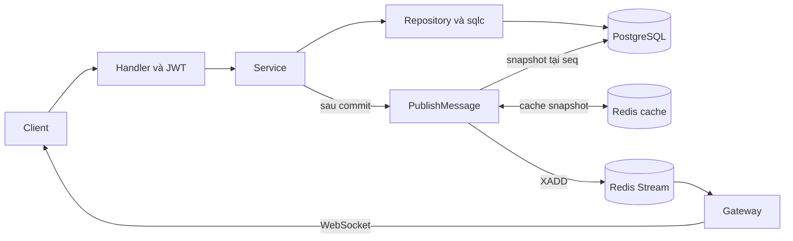

# Luồng xử lý Mini-Hermes

## Kiến trúc

| Thành phần | Trách nhiệm |
| --- | --- |
| Middleware/handler | Xác minh JWT, đọc request và ánh xạ lỗi HTTP |
| Service | Kiểm tra nghiệp vụ, tra actor và điều phối publish |
| Repository/sqlc | Kiểm tra membership, truy vấn và transaction PostgreSQL |
| Redis | Vé WebSocket, cache membership và Stream sự kiện |
| Gateway | Fan-out tới recipient; không kết nối PostgreSQL |
| Web client | HTTP/socket, cache lịch sử, IndexedDB và crypto Go/WASM |

```mermaid
flowchart LR
    C[Client] --> H[Handler và JWT]
    H --> S[Service]
    S --> R[Repository và sqlc]
    R --> DB[(PostgreSQL)]
    S -->|sau commit| P[PublishMessage]
    P -->|snapshot tại seq| DB
    P <-->|cache snapshot| RC[(Redis cache)]
    P -->|XADD| RS[(Redis Stream)]
    RS --> G[Gateway]
    G -->|WebSocket| C
```

## Luồng chính

1. **Auth:** đăng ký lưu bcrypt hash; đăng nhập trả JWT HS256 chứa user UUID trong `sub`. Browser đổi JWT lấy vé WebSocket một lần; gateway dùng Redis `GETDEL` trước upgrade.
2. **Direct:** khóa hai user theo ID tăng dần, tìm thread của cặp hoặc tạo mới trong transaction. Mode mặc định plaintext; E2EE cần IK/SPK hợp lệ. Mode khác thread cũ trả `409`.
3. **Nhóm:** tạo thread, participants và system message đầu tiên cùng transaction. Thêm/xóa/rời và gửi tin cùng khóa thread; mỗi lần tham gia giữ một khoảng `joined_seq..left_seq`.
4. **Gửi:** khóa thread, kiểm tra lại membership, tra message UUID. Retry đúng payload trả tin cũ; UUID khác dữ liệu trả `409`. Tin mới tăng `last_seq` và insert trong cùng transaction.
5. **Publish:** sau commit, lấy snapshot membership tại `message.seq`, tạo `recipient_ids` rồi `XADD`. Text loại sender; system giữ toàn bộ snapshot.
6. **Nhận:** gateway đọc Stream và chuyển tiếp tới mọi kết nối hiện có của recipient. Client gộp UUID, sắp theo seq; tin bỏ lỡ lấy bù qua REST.

API chỉ kiểm tra format/header E2EE; không có private key để giải mã. Envelope được lưu nguyên chuỗi trong `messages.content`. Chi tiết tại [luồng X3DH](e2ee-sequence.md).

## Publish và gateway

- Cache key: `<stream>:membership:<thread UUID>:<version>`, TTL 15 phút. Version là boundary lớn nhất không vượt message seq: `joined_seq` hoặc `left_seq + 1`.
- Cache miss/lỗi đọc PostgreSQL; lỗi ghi cache không chặn publish. GET/SET tối đa 100 ms mỗi lần, trong tổng `redis.publish_timeout`. Cache không quyết định quyền.
- Stream có `event=message.created`, UUID message/thread/sender, `recipient_ids`, `thread_kind`, `seq`, `kind`, `content_format`, `content`, `created_at`. Frame WebSocket dùng `type=message.created` và `recipient_id` của kết nối.
- Publish lỗi sau commit trả `503` kèm thread/message UUID và seq; retry có thể phát event trùng. Chưa có outbox.
- Gateway dùng group `ws-gateway`, consumer `gateway-1`, một instance. Đọc pending bằng `XREADGROUP ... 0` trước entry mới bằng `>`; `XACK` sau xử lý, kể cả khi recipient offline.
- Heartbeat mỗi 5 giây; kết nối chậm bị đóng. Shutdown đóng socket và chờ các vòng xử lý với hạn chung 5 giây.

## Lịch sử và read marker

- Lịch sử chỉ thuộc các khoảng membership, trả `seq DESC`; `limit` mặc định 30, tối đa 100. `before_seq` lấy trang cũ hơn; `next_cursor=null` khi hết. Không có `after_seq`.
- Read marker chỉ tăng bằng `GREATEST`, yêu cầu membership đang hoạt động và `joined_seq - 1 <= N <= threads.last_seq`.
- Unread là COUNT tin text/system do người khác tạo sau marker trong membership hiện tại; không bằng `last_seq - last_read_seq`.
- Client lấy bù tới baseline hoặc hết cursor trước khi hoàn tất initial sync. Chỉ tăng marker tới seq đã render khi thread đang mở, tab hiển thị và ở cuối chat; không vượt `syncedSeq`.
- E2EE còn yêu cầu tab sở hữu state, giải mã và local commit thành công. Response cũ bị loại theo phiên/cache/membership; không polling lịch sử.

Schema: [ERD](chat-api-erd.md). Quyết định: [gateway](adr/001-gateway-and-stream.md), [unread](adr/002-unread-count.md), [sequence](adr/003-message-order.md).
