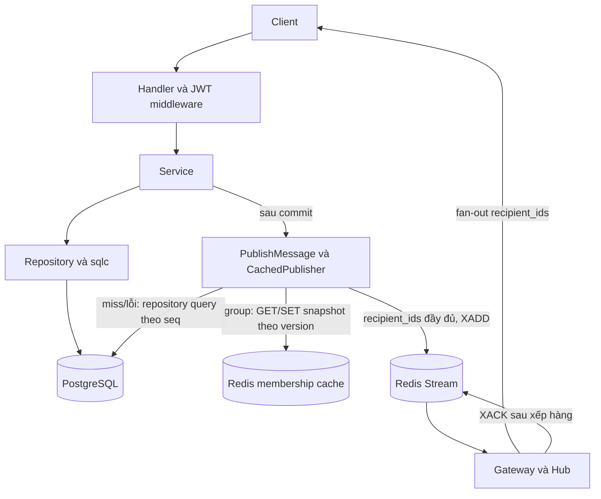

# Luồng request Mini-Hermes

## Ranh giới các tầng

- DTO chỉ định nghĩa JSON HTTP; không chứa `password_hash` hoặc ID `BIGINT` nội bộ.
- Handler bind request, lấy external user ID đã xác thực từ Gin context và ánh xạ lỗi HTTP.
- Service chuẩn hóa username, kiểm tra input, băm/so mật khẩu và tra actor nội bộ; không phụ thuộc Gin.
- Repository dùng sqlc/PostgreSQL, kiểm tra participant và giữ transaction.
- Message service và các thao tác nhóm trong thread service gọi cùng publisher Redis Streams sau khi repository đã commit; publisher không nằm trong transaction PostgreSQL.
- `PublishMessage` giữ một đường timeout/lỗi sau commit. `CachedPublisher` điều phối snapshot cache/DB rồi gọi publisher `XADD`; Redis membership cache chỉ tối ưu việc lấy danh sách UUID, không kiểm tra quyền.
- JWT manager trong `internal/token` ký/xác minh token, không phụ thuộc Gin.
- Bearer middleware chỉ xác minh token và đặt external user ID từ `sub` vào context; không truy vấn database.
- Vé WebSocket đi qua handler → service → Redis repository: API dùng `SETNX` với TTL; gateway dùng `GETDEL` nguyên tử trước khi upgrade.


```mermaid
flowchart TD
    C[Client] --> H[Handler và JWT middleware]
    H --> S[Service]
    S --> R[Repository và sqlc]
    R --> DB[(PostgreSQL)]
    S -->|sau commit| P[PublishMessage và CachedPublisher]
    P -->|group: GET/SET snapshot theo version| MC[(Redis membership cache)]
    P -->|miss/lỗi: repository query theo seq| DB
    P -->|recipient_ids đầy đủ, XADD| X[(Redis Stream)]
    X --> G[Gateway và Hub]
    G -->|fan-out recipient_ids| C
    G -->|XACK sau xếp hàng| X
```

## Auth

`POST /auth/register` dùng chung `NormalizeUsername`, kiểm tra password, băm bcrypt rồi ghi `password_hash`. Response không chứa mật khẩu hoặc hash.

`POST /auth/login` chuẩn hóa username, lấy credentials và so bcrypt. Sai username và sai password trả cùng `invalid username or password`. JWT HS256 chứa external UUID trong `sub`, cùng `iat` và `exp`; secret/TTL đến từ config runtime.

Một PostgreSQL user repository phục vụ cả đăng ký/đăng nhập, lookup user và danh sách user. Không còn constructor truyền cùng repository hai lần và không còn luồng tạo user thiếu password.

## Tạo hoặc mở direct thread

`POST /threads/direct` nhận `peer_id`; actor đến từ JWT.

1. Service tra actor và peer sang ID `BIGINT`, đồng thời chặn chat với chính mình.
2. Repository sắp cặp ID thành low/high, bắt đầu transaction và khóa hai dòng `users` theo đúng thứ tự tăng dần. PostgreSQL row lock dùng chung giữa mọi connection/process/instance; thứ tự toàn cục này tránh deadlock khi các cặp giao nhau.
3. Sau khi có đủ hai khóa, repository tìm direct thread có đúng hai active participant là cặp đó, bất kể ai gửi request trước.
4. Nếu chưa có, repository ghi thread và hai participant trong cùng transaction. Request đồng thời đợi khóa rồi đọc lại thread vừa commit.

Không còn cột cặp user hay unique index tương ứng trên `threads`. Vì vậy cơ chế chống trùng phụ thuộc mọi đường ghi direct thread đều dùng transaction/khóa trên; thao tác SQL trực tiếp hoặc implementation khác bỏ qua khóa có thể tạo trùng.

## Nhóm và membership

`POST /threads/group` đi qua thread handler/service/repository:

1. Service kiểm tra tên, số lượng, UUID không trùng/không gồm creator, rồi tra các user nội bộ.
2. Repository tạo thread, creator role admin và các member; mọi khoảng membership bắt đầu ở seq 1.
3. Cùng transaction, tăng `last_seq`, ghi system message tạo nhóm và lấy version membership tại seq 1.
4. Commit rồi service mới publish qua publisher dùng chung với gửi tin.

Thêm/xóa/rời nhóm khóa dòng thread, đọc lại actor/role và membership đích sau khi có khóa. Admin được thêm/xóa người khác; actor tự rời. Thay đổi interval và system message dùng cùng `seq` trong một transaction. Khi admin cuối rời, thành viên còn lại có `(joined_seq, user_id)` nhỏ nhất thành admin. Group tối đa 100 người.

Thêm người đang active hoặc xóa/rời người đã inactive trả system message ở `joined_seq`/`left_seq` hiện tại, không tăng seq; publish lại có thể tạo stream entry trùng. Tạo nhóm chưa có idempotency key: lỗi publish trả 503 kèm thread/message UUID đã lưu, client đối chiếu trước khi tạo lại. Các thao tác không có quyền hoặc transaction rollback không publish.

PostgreSQL vẫn quyết định quyền. API có cache snapshot membership dùng thực tế trong publish; web dùng chung cache/luồng thread cho direct và group. Gateway fan-out theo danh sách trong event và không query DB/cache.

## Snapshot membership trong publish

`GetMembershipVersion` đọc các boundary trong `participants` khi transaction vẫn giữ khóa thread: `joined_seq` cho thêm, `left_seq + 1` cho xóa/rời. MAX boundary không vượt seq của message là version. Message cũ được retry cũng tính version theo seq cũ, không theo `threads.last_seq` hiện tại. Snapshot của một version không đổi khi có membership mới ở seq lớn hơn.

Sau commit, `PublishMessage` tạo context độc lập với request bị hủy, có tổng timeout cấu hình và ánh xạ lỗi sang `EventPublishError` chứa UUID/seq đã lưu. `CachedPublisher` thực hiện:

1. Direct dùng recipient đã lấy trong transaction; không truy cập membership cache.
2. Group GET `<stream>:membership:<thread UUID>:<version>`; snapshot có thread/version và danh sách external UUID gồm sender. Cache hit không gọi query lấy UUID từ DB.
3. Miss/lỗi thì repository `ListMemberIDsAtSequence` JOIN participants/users theo khoảng bao phủ **message.seq**. Query này vẫn đúng nếu membership đã thay đổi trong khoảng từ commit đến publish. Lỗi query dừng publish và trả 503; không đoán recipient hoặc dùng danh sách active.
4. Thử SET snapshot TTL 15 phút, lỗi cache chỉ ghi log. GET và SET mỗi thao tác tối đa 100 ms để còn thời gian fallback và XADD.
5. Text loại sender, system giữ cả actor/người vừa rời. Publisher XADD event có `recipient_ids` đầy đủ như contract trước.

Ví dụ Bob tham gia từ seq 1, bị xóa tại seq 5: system seq 5 dùng version 1 và vẫn gồm Bob; text seq 6 dùng version 6 và loại Bob. Thêm lại tại seq 9 tạo version 9; retry seq 2 vẫn lấy key version 1, hoặc query DB tại seq 2 nếu key đã hết TTL. Bob không nhận seq 6–8, người mới ở seq 9 không nhận event trước đó.

Version mới thay thế việc vô hiệu hóa một key "current members" mutable: message sau thay đổi không thể dùng key cũ, còn các key lịch sử được giữ tới TTL để phục vụ retry. Không cần schema/migration mới, đồng bộ DEL hay so version tại gateway. Cache không tránh query scalar version hoặc kiểm tra quyền PostgreSQL; nó tránh query và truyền toàn bộ UUID lặp lại giữa các thay đổi membership.

Gateway chỉ dùng `recipient_ids` đã lưu trong mỗi stream entry, kể cả pending cũ; không đọc membership hiện tại. Nếu stream có entry legacy với `recipient_id`, consumer chuyển thành một phần tử; thiếu `thread_kind` mặc định direct. Entry group cũ có `recipient_ids` cũng đọc nguyên vẹn, không yêu cầu version và không phải xóa stream.

## Gửi tin

`POST /threads/:id/messages` nhận `message_id` và `content`, không nhận sender. `message_id` là UUID client đã chọn cho `messages.external_id`; response vẫn trả external ID trong `id`.

Trong một transaction, repository khóa thread rồi đọc lại membership đang hoạt động sau khi lấy được khóa. Thao tác thêm/xóa/rời nhóm và cập nhật read marker dùng cùng khóa. Sau đó repository tra `external_id` toàn cục:

1. UUID đã thuộc đúng sender, thread, kind/format và nội dung: trả message cũ, không tăng `last_seq`.
2. UUID đã gắn với bất kỳ dữ liệu nào khác: trả `409 Conflict` chung, không trả message cũ nên không lộ nội dung/người gửi/thread của người khác.
3. UUID chưa có: tăng `last_seq`, ghi message với sequence đó và commit.

Unique constraint trên `messages.external_id` xử lý cả race giữa các thread/instance. Nếu insert thua race, toàn transaction (kể cả tăng sequence) rollback và API trả conflict. Hai request retry giống hệt trong cùng thread được serialize bởi khóa thread nên chỉ có một row.

Sau khi repository trả thành công, service gọi luồng publish chung để phát một entry `event=message.created` bằng `XADD`. Entry dùng external UUID `message_id`, `thread_id`, `thread_kind`, `sender_id`, `recipient_ids` cùng `seq`, `kind`, `content_format`, `content`, `created_at`. `recipient_ids` là mảng JSON dựa trên membership PostgreSQL bao phủ `seq` của message, có thể tái sử dụng từ cache snapshot, không đến từ client. Text loại sender; system message gồm toàn bộ thành viên ở mốc đó. Retry vẫn dùng mốc `seq` cũ; sender phải đang active để gọi gửi/retry.

Publisher chạy với timeout cấu hình. Lỗi transaction/quyền/UUID conflict xảy ra trước publisher nên không có event. Nếu PostgreSQL đã commit nhưng snapshot fallback hoặc XADD lỗi, API trả `503` để client retry đúng UUID và payload. Retry không tạo message hay tăng `seq`, nhưng vẫn thử publish lại. Do timeout có thể xảy ra sau khi Redis đã nhận lệnh, stream có thể chứa entry trùng; gateway chuyển tiếp từng entry và client khử trùng theo `message_id`. Luồng này không phải exactly-once và không thể bảo đảm realtime nếu client không retry; chưa có outbox.

Thread tồn tại nhưng actor không phải participant trả `403`; thread không tồn tại trả `404`.

Gateway dùng một consumer name cố định cho một instance. Nó đọc lại pending bằng `XREADGROUP ... 0` trước khi đọc entry mới bằng `XREADGROUP ... >`, duyệt `recipient_ids` trong event để xếp tin vào mọi kết nối hiện có của người nhận mà không truy vấn PostgreSQL. Sau khi xử lý entry, gateway `XACK` cả khi người nhận offline. ACK chỉ xác nhận gateway đã xử lý stream entry, không xác nhận WebSocket đã giao tin hoặc người nhận đã đọc; lịch sử vẫn lấy từ PostgreSQL.

## Đọc lịch sử

`GET /threads/:id/messages` tra actor từ JWT và kiểm tra actor từng là participant. `limit` mặc định 30, nằm trong `1..100`; `before_seq` nếu có phải dương. Repository query `seq DESC`, lấy `limit + 1`, dùng `EXISTS` để giữ message trong ít nhất một khoảng `joined_seq <= seq <= left_seq` của user (left_seq null là vẫn tham gia). Thêm lại tạo khoảng mới; không trả tin trong khoảng vắng mặt và không dùng `OFFSET`, timestamp hay message ID toàn cục.

```json
{
  "messages": [
    { "seq": 5, "content": "Tin 5" },
    { "seq": 4, "content": "Tin 4" }
  ],
  "next_cursor": 4
}
```

Trang tiếp theo gọi `?before_seq=4&limit=2` và chỉ nhận message có `seq < 4`. `next_cursor` là `null` khi không còn trang cũ hơn.

## Read marker và unread

`PUT /threads/:id/read` nhận `{ "last_read_seq": N }`; actor không bao giờ đến từ body. Repository khóa thread và kiểm tra membership; SQL chỉ update participant đang hoạt động khi `joined_seq - 1 <= N <= threads.last_seq`, đồng thời dùng `GREATEST(last_read_seq, N)`. Vì vậy request cũ đến muộn không thể làm marker giảm. Thread rỗng chấp nhận mốc `0`.

Hai query summary thread cùng trả `last_read_seq`, `peer_last_read_seq` và `unread_count`. `unread_count` là `COUNT(*)` trên các message nằm trong phạm vi xem, có `seq > last_read_seq`, do người khác gửi và `kind <> 'system'`; không suy ra từ `last_seq - last_read_seq`. Với group, summary có `name`, `role`, `member_count`, `joined_seq`, không có peer. `joined_seq` xác định khoảng membership đang hoạt động để web xóa marker đang chờ và bỏ response read/member cũ khi user đã tham gia lại; đây là metadata từ participant hiện có, không cần migration. UI direct dùng `peer_last_read_seq` để hiện “Đã đọc” cho tin mình gửi có `seq` không lớn hơn marker đó.

## Web demo

Router phục vụ HTML/CSS hiện có và hai file JS: `app.js` điều phối DOM, HTTP, phiên tài khoản và socket; `realtime-core.js` giữ các hàm thuần để gộp tin, phân trang lấy bù và kiểm tra khoảng seq/read marker.

State có một map theo external thread UUID. Mỗi entry giữ summary, trạng thái active/quyền đang đối chiếu, messages theo seq/ID, khoảng đã xác nhận, cursor, draft, pending send và các request đang chạy. Lookup peer → direct thread được tính từ map khi mở chat; không có bản summary thứ hai theo peer.

1. Đăng ký/đăng nhập, lưu JWT trong sessionStorage của tab, lấy user từ `/users`. Chọn peer chưa có thread mới POST direct; sau đó direct/group đều đi qua `openThread(threadID)`. Cache đã tải được render ngay; mở lại không GET history hay xin vé.
2. Form nhóm chọn user từ danh sách đang có. Tạo nhóm POST đúng một lần. `readResponse` giữ cả body lỗi; 503 có thread UUID chuyển sang GET `/threads` đối chiếu nhóm đã commit. Lỗi không có UUID giữ trạng thái chưa xác nhận để tránh tự tạo trùng. Thêm/xóa/rời cũng đối chiếu quyền từ REST sau thành công hoặc lỗi; không phân tích câu chữ system message.
3. Mỗi phiên chỉ có một WebSocket. Vé chỉ xin khi bắt đầu/kết nối lại; đổi thread hay tab không xin vé ngoài lịch retry. Giữ heartbeat, watchdog và backoff hiện có. Socket mở lại mới GET summary và lấy bù các thread đã cache qua cursor đến baseline đã đồng bộ, kể cả hơn 30 tin.
4. Text event cập nhật entry đúng thread, tăng unread một lần cho text từ người khác và gộp theo ID/seq. Event liên tục đúng thứ tự không GET history/summary mỗi tin. Event có gap lấy bù bằng REST; event system mới được gộp thành một lần đối chiếu summary và thành viên nếu panel đang mở. Event trùng không lặp đối chiếu. GET summary bắt đầu trước một thay đổi membership bị bỏ và lấy lại để tránh phục hồi quyền cũ.
5. Summary REST là danh sách membership active. Nhóm không còn trong response được đánh inactive, tắt gửi/quản lý/read marker, không có unread. Có thể giữ entry ghi rõ **Đã rời (lịch sử)** trong phiên để xem phần đã được cấp quyền; lấy bù một lần lúc chuyển inactive để nhận thông báo rời/xóa đã bỏ lỡ. `joined_seq` mới làm tăng epoch membership, xóa pending marker/seen và bỏ response cũ. Role/admin đến từ REST; PostgreSQL vẫn kiểm tra mọi thao tác.
6. Trang REST xác nhận một khoảng numeric seq giữa cursor và message cao nhất. Gap bên trong khoảng này là đã được server xác nhận (bao gồm khoảng vắng mặt); gap ngoài khoảng vẫn là chưa đồng bộ. Lấy bù không lặp lại cùng target không truy cập được. Read marker duyệt message đã được phép xem theo seq, chỉ vượt gap đã xác nhận và chỉ tăng tới tin nhận thực sự hiển thị. Tin mình gửi/system được bỏ qua; marker không nhảy qua tin nhận chưa thấy hoặc phần lịch sử chưa tải. Fetch nền và scroll do render/gửi tạo ra không tự đánh dấu đã đọc.
7. Gửi/retry chung cho direct/group: giữ nguyên UUID/payload khi lỗi mạng/5xx, retry một lần tự động, sau đó giữ pending trong entry với nút **Gửi lại**. Nội dung đã sửa không được dùng cho UUID cũ. Response đến muộn cập nhật đúng cache; DOM chỉ cập nhật nếu thread/phiên tương ứng đang mở. Trạng thái “Đã đọc” theo peer chỉ hiển thị cho direct.
8. Logout/đổi tài khoản abort HTTP của phiên cũ, hủy timer/socket và xóa map/cache/draft/pending. Mọi response và callback đều kiểm tra phiên; read/member còn kiểm tra epoch membership. `401` của phiên hiện tại đưa về đăng nhập.

Không thêm E2EE, presence hay nhiều gateway instance. Không có test web/gateway thường trực; kịch bản browser/HTTP/WebSocket tạm phải được xóa sau khi chạy.
